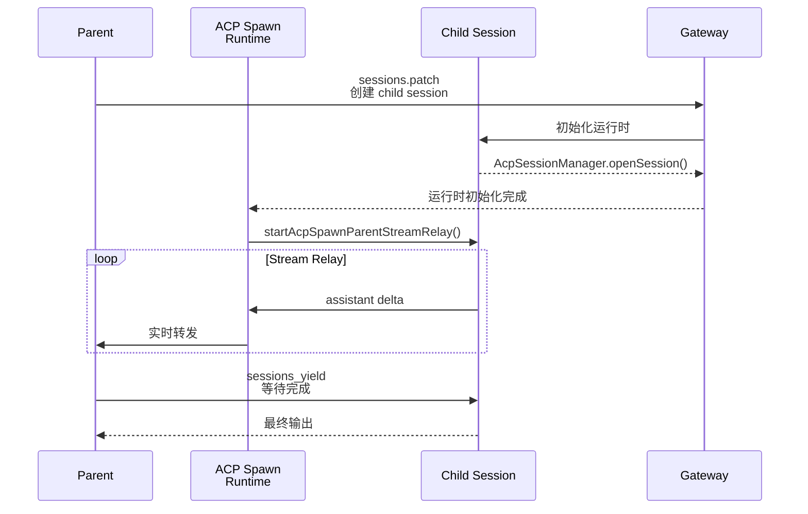

# 使用方法

## 完整的 spawn 链



## 标准调用格式

```javascript
// sessions_spawn 调用示例
sessions_spawn({
  runtime: "acp",
  agentId: "coder",      // 目标 agent
  mode: "session",        // session 模式（不是 run）
  thread: true,           // 创建独立 thread
  task: "帮我写一个排序算法",
  streamTo: "parent"      // 流式转发到 parent session
})
// 返回: { status: "accepted", sessionKey: "agent:coder:acp:${uuid}" }

// 收集结果（必须调用）
sessions_yield({ message: "等待子任务完成" })
```

## Session Key 格式

```
parent session:  agent:main:session:${uuid}
child session:   agent:${targetAgentId}:acp:${uuid}
```

## 任务编排模式

### 模式一：顺序执行（Chain）

```
Parent spawns Task A → yields → Result A
↓
Parent spawns Task B (with Result A) → yields → Result B
```

### 模式二：并行执行（Fan-out）

```
Parent spawns Task A ──┐
Parent spawns Task B ──┼──→ Parent synthesizes results
Parent spawns Task C ──┘
```

### 模式三：树形执行（Tree）

```
Parent spawns Task A ──┬── spawns Task A1
                        └── spawns Task A2
Parent spawns Task B ──┬── spawns Task B1
                        └── spawns Task B2
```

## 避坑检查清单

```
✅ spawn 前：确认 agentId 正确（拼写无误）
✅ spawn 前：确认 ACP 协议已启用（isAcpEnabledByPolicy 返回 true）
✅ spawn 后：调用 sessions_yield 收集结果
✅ 执行中：监控 .acp-stream.jsonl 是否有数据
✅ 完成后：确认 child session closed
⚠️ ACP 桥接 Claude Code：不要用（格式不兼容）
⚠️ 并发 spawn：确保每次 spawn 的 session key 唯一
⚠️ 长时间任务：设置超时，人工介入点
```

## 已知坑位

| 坑 | 描述 | 影响 |
|----|------|------|
| **Child 超时不自杀** | noOutputNoticeMs/maxRelayLifetimeMs 有监控但无强制 kill | 孤儿进程占用资源 |
| **Stream relay 数据丢失** | relayBuffer 在内存中，没写盘就崩溃就丢了 | 重要任务的中间结果丢失 |
| **飞书并发 Spawn 冲突** | <100ms 内两次 spawn 共享 thread_id | 流混在一起 |
| **spawn 后没有 yield** | Agent 调用 sessions_spawn 但不调用 sessions_yield | 不知道任务结果 |
| **ACP 桥接 Claude Code** | 格式不兼容，多模态 content 丢失 | 复杂任务不可用 |

## 流式转发（Stream Relay）机制

`startAcpSpawnParentStreamRelay()` 负责把 child 的 assistant delta 实时转发回 parent session。

**工作方式：**
1. Child 每次有 assistant 输出（delta），发送给 relay
2. Relay 把 delta 写入 `.acp-stream.jsonl`（持久化）
3. 同时把 delta 转发给 parent session
4. Parent 的 UI 可以实时看到 child 的执行过程

**这比 Hermes 的 tool_call 模式体验好很多**——你能看到子 Agent 正在做什么，而不是等它全部完成才能看到结果。