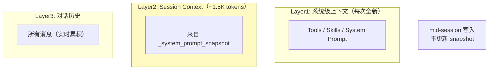
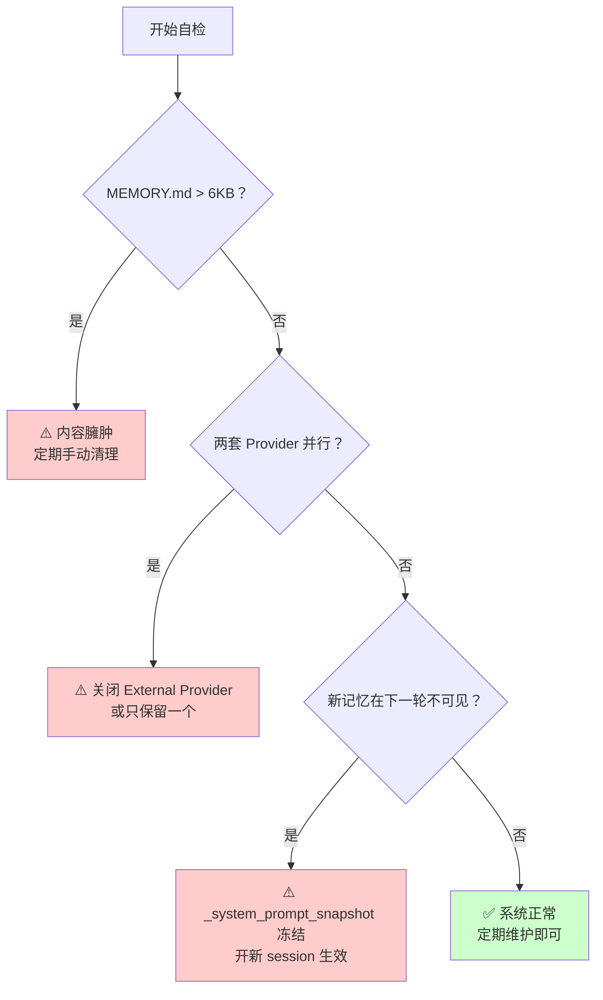

# 使用方法

本文档是 Hermes 实战经验的完整汇总，按模块分类。遇到问题直接翻对应章节。

---

# ═══════════════════════════════
# 模块一：Skills 系统
# ═══════════════════════════════

## Skills 自动创建的根因

Hermes 有 skills 自动创建机制，当检测到重复任务模式时会自动生成新的 skill。这些 skill 存放在 `~/.hermes/skills/` 下的非官方目录。

**两套驱动机制：**
1. **Nudge 提醒**：给主 Agent 发消息建议创建 Skill（需要显式调用 `skill_manage()`）
2. **背景审查（自动）**：响应发送后在**后台线程**中 fork 新 AIAgent，注入审查 prompt，**自主调用** `skill_manage()` 创建或更新 Skill，无需确认

## 查看当前状态

```bash
# 查看有多少 skills 是用户创建的（非 hermes 官方）
find ~/.hermes/skills/ -name "SKILL.md" -type f \
  -not -path "*/hermes/*" \
  -not -path "*/mcp/*" | wc -l

# 查看 Hermes 官方 bundled skills
ls ~/.hermes/skills/hermes/

# 查看当前 auto-creation 配置
grep -r "creation_nudge_interval\|auto_create_after" \
  ~/.hermes/config.yaml 2>/dev/null \
  || echo "未配置，使用默认值（10次 tool calls 触发）"
```

## 关闭 auto-creation

```yaml
# ~/.hermes/config.yaml
skills:
  creation_nudge_interval: 0  # 关闭 Nudge 提醒和背景审查触发
```

> ⚠️ **注意**：配置路径是 `skills.creation_nudge_interval`（在顶层 `skills` 下），**不是** `agent.skill_manager.disabled`。设为 0 时完全关闭自动创建。

验证：
```bash
grep -r "creation_nudge_interval" ~/.hermes/config.yaml 2>/dev/null \
  || echo "未配置，使用默认值（10次触发）"
```

## 定期 review Skills

**方法一：手动 audit（每月一次）**

```bash
# 列出所有 skills（含创建时间）
echo "=== Hermes Bundled Skills ==="
ls -lt ~/.hermes/skills/hermes/

echo "=== User-Created Skills ==="
ls -lt ~/.hermes/skills/

# 查看哪些 skills 从未被调用（以文件修改时间判断）
find ~/.hermes/skills/ -name "SKILL.md" -type f \
  -not -path "*/hermes/*" \
  -exec stat -f "%m %N" {} \; \
  | sort -n | head -10
```

**方法二：达尔文 skill 优化**

> 📌 **工具来源**：https://github.com/alchaincyf/darwin-skill

用达尔文方法对所有 skills 做 8 维度评分，定期淘汰低质量 skills：

```bash
# 在 Hermes 里说："帮我用达尔文方法 review 所有 skills"
# 触发 darwin-skill，按 8 个维度对每个 skill 评分：
# 1. Structure — SKILL.md frontmatter 是否规范
# 2. Clarity — description/triggers 是否无歧义
# 3. Coverage — triggers 是否覆盖真实使用场景
# 4. Recency — 内容是否与当前系统版本匹配
# 5. Compatibility — 是否依赖已废弃的 tool/API
# 6. Uniqueness — 是否与现有 skill 功能重复
# 7. Utility — 实际被调用的频率
# 8. Maintainability — 更新一次能覆盖多少场景
```

## 推荐目录结构

```
~/.hermes/skills/
├── hermes/          # Hermes 官方（只读，不要改）
├── mcp/             # MCP 协议集成（只读）
└── [user-created]/  # 用户创建的 skills（定期 review）
```

**不要删除 hermes/ 和 mcp/ 下的任何内容。**

---

# ═══════════════════════════════
# 模块二：Memory 系统
# ═══════════════════════════════

## 三层上下文结构



**关键：** Layer 2 的 snapshot 在 `load_from_disk()` 时捕获，之后 `add()`、`replace()`、`remove()` 只更新磁盘文件，**不更新 snapshot**。只有开新 session 才能看到新记忆。

## 记忆紊乱的三种典型表现

| 表现 | 根因 |
|------|------|
| 新记忆在当前 session 下一轮就忘了 | `_system_prompt_snapshot` frozen |
| 两套 Provider 告诉你的内容不一致 | Provider 简单拼接无去重 |
| subagent 的内容出现在用户记忆里 | `agent_context` 隔离不严格 |

## 自检三步法

### Step 1：检查 MEMORY.md 是否臃肿

```bash
wc -c ~/.hermes/memories/MEMORY.md
# 正常 < 6KB，超过说明需要清理
```

### Step 2：检查是否有多 Provider 并行

```bash
grep -r "honcho\|mem0\|hindsight\|external" \
  ~/.hermes/config.yaml 2>/dev/null
# 如果有输出，说明存在两套 Provider 并行
```

### Step 3：验证 mid-session 写入是否生效

```
在 MEMORY.md 里加一条：咖啡不加糖
然后立刻问：我咖啡怎么喝的？
如果回答不知道，说明 _system_prompt_snapshot 未更新。
```

## 临时解决方案

**方案一：开新 session 使记忆生效（最简单）**

**方案二：把高频事实写死在 SOUL.md**

```markdown
# SOUL.md
## 关于用户
- 用户叫月明
- 咖啡不加糖
- 主要用飞书沟通
```

**方案三：关闭 External Provider（减少混乱）**

```yaml
# ~/.hermes/config.yaml
memory:
  provider: null  # 关闭外部记忆服务，只用内置
```

**方案四：控制单 session 轮数（< 30 轮）**

## 根本解法（需官方修复）

- `_system_prompt_snapshot` 支持 mid-session 更新
- 两套 Provider 加入去重和优先级机制
- `BuiltinMemoryProvider` 支持按需移除

## 判断树



---

# ═══════════════════════════════
# 模块三：SubAgent 机制
# ═══════════════════════════════

## Profile 机制

Hermes 有 profile 机制，每个 profile 是**独立的 HERMES_HOME 目录**——不同的 skills、memory、config。运行不同 profile 等于启动**不同的 Hermes 进程**。

```bash
# ~/.hermes/profiles/
# ├── main/          # 主 Agent
# ├── coder/         # 编程 Agent（独立 HERMES_HOME）
# └── creative/      # 创意 Agent

# 切换 profile
/hermes switch-profile coder
```

**这不是"同一个 Agent 内动态切换"，本质上是"多套独立配置"。**

## claude-code / codex 的真实定位

**重要：** `claude-code` 和 `codex` 是 Hermes **内置的 tool 实现**（在 `tools/` 目录下），不是 `~/.hermes/skills/` 里的 SKILL.md 文件。

```python
hermes-agent/tools/
├── claude_code_tool.py   # 内置 tool，不是 SKILL.md
└── codex_tool.py          # 内置 tool，不是 SKILL.md
```

它们的使用方式是 `tool_call`，调用外部 CLI 进程：
- 没有 session key
- 没有流式转发（streaming relay）
- 没有生命周期管理

**这是"外部工具调用"而不是"真正的 Session 隔离委托"。**

## Hermes vs OpenClaw SubAgent 对比

| 维度 | Hermes | OpenClaw |
|------|--------|----------|
| SubAgent 机制 | Profile 切换 + tool_call | sessions_spawn + ACP |
| 隔离方式 | 无 session 隔离 | 独立 session key |
| 流式转发 | 无 | ✅ stream relay |
| 生命周期管理 | 无 | ✅ AcpSessionManager |
| 外部 CLI 调用 | ✅ claude-code/codex | ❌（格式不兼容） |

---

# ═══════════════════════════════
# 模块四：避坑清单
# ═══════════════════════════════

## Skills 系统

```
✅ 关闭自动创建：skills.creation_nudge_interval: 0
✅ 每周手动清理一次 Skills（删除长期未用的）
✅ 用 darwin-skill 做定期 8 维度 review
✅ 两个 Skill 的 description 关键词重叠超过 50% → 直接合并
✅ 控制 Skills 目录结构：hermes/（只读）+ mcp/（只读）+ [user-created]
❌ 不要让 Skills 数量超过 50 个
❌ 不要删除 hermes/ 和 mcp/ 下的任何内容
```

## Memory 系统

```
✅ 开新 session 使新记忆生效
✅ 定期手动维护 MEMORY.md（控制大小 < 6KB）
✅ 把高频事实写死在 SOUL.md 里
✅ 控制单 session 轮数（< 30 轮）
✅ 关闭不用的 External Memory Provider
✅ 定期备份 ~/.hermes/memories/MEMORY.md
❌ 不要在 cron job 里写入 MEMORY.md
❌ 不要同时开两套 Provider
❌ 不要在单个 session 做超过 60 轮
```

## SubAgent / Claude Code

```
✅ 用 profile 做进程级隔离
✅ 复杂多步任务开新 session
✅ 给 claude-code 任务设置超时手动 kill
❌ 不要用 claude-code 做需要跟踪进度的任务
❌ 不要同时启动多个 profile 的 Hermes（端口冲突）
```

## 定期维护任务

```bash
# 每周一次：Skills review（按修改时间，长期未动的优先考虑删除）
find ~/.hermes/skills/ -name "SKILL.md" -type f \
  -not -path "*/hermes/*" -mtime +30 -exec ls -l {} \;

# 每周一次：MEMORY.md 备份 + 清理
cp ~/.hermes/memories/MEMORY.md \
  ~/.hermes/memories/MEMORY.md.bak.$(date +%Y%m%d)
```
