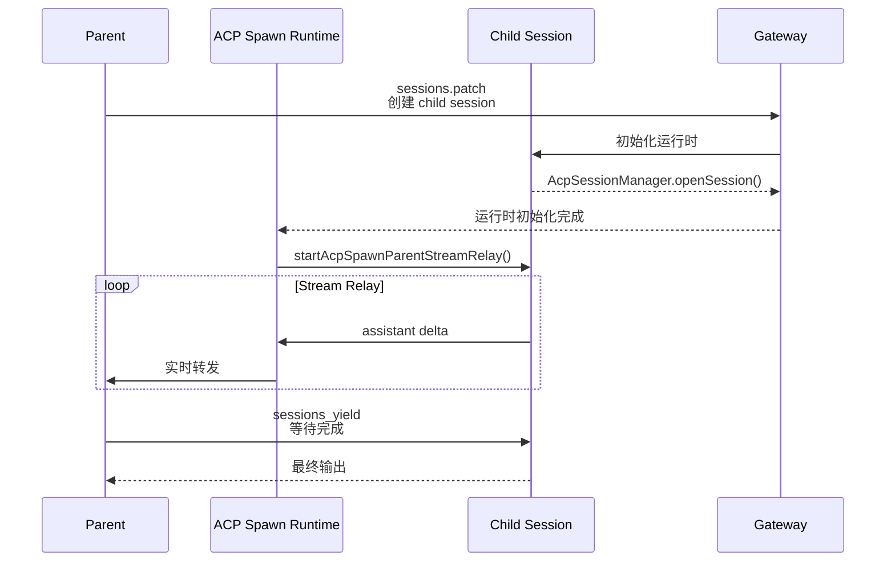

# 使用方法

本文档是 OpenClaw 实战经验的完整汇总，按模块分类。遇到问题直接翻对应章节。

---

# ═══════════════════════════════
# 模块一：ACP Sessions Spawn
# ═══════════════════════════════

## 完整 spawn 链



## 标准调用格式

```javascript
// sessions_spawn 调用示例
sessions_spawn({
  runtime: "acp",
  agentId: "coder",      // 目标 agent
  mode: "session",        // session 模式（不是 run）
  thread: true,           // 创建独立 thread
  task: "帮我写一个排序算法",
  streamTo: "parent"      // 流式转发到 parent session
})
// 返回: { status: "accepted", sessionKey: "agent:coder:acp:${uuid}" }

// 收集结果（必须调用）
sessions_yield({ message: "等待子任务完成" })
```

## Session Key 格式

```
parent session:  agent:main:session:${uuid}
child session:   agent:${targetAgentId}:acp:${uuid}
```

## 任务编排模式

### 顺序执行（Chain）

```
Parent spawns Task A → yields → Result A
↓
Parent spawns Task B (with Result A) → yields → Result B
```

### 并行执行（Fan-out）

```
Parent spawns Task A ──┐
Parent spawns Task B ──┼──→ Parent synthesizes results
Parent spawns Task C ──┘
```

### 树形执行（Tree）

```
Parent spawns Task A ──┬── spawns Task A1
                        └── spawns Task A2
Parent spawns Task B ──┬── spawns Task B1
                        └── spawns Task B2
```

## ACP 超时配置

```
ACP SubAgent 超时配置：
- noOutputNoticeMs: 无输出多久后发通知
- maxRelayLifetimeMs: 最大 relay 生命周期
- Child 进程在超时时会被监控，但不保证强制 kill
```

> ⚠️ **监控 ≠ kill**：官方写了"监控"，但没写"kill"。Child 进入死循环或长时间无输出，Parent 只能等 gateway 重启，Child 变成孤儿进程继续占用资源。

---

# ═══════════════════════════════
# 模块二：Memory 系统
# ═══════════════════════════════

## 三大并发场景

### 场景一：memory.db lock timeout

高并发飞书消息同时触发 memory 写入，SQLite busy_timeout（默认 5s）可能不够用。

**诊断：**
```bash
cat ~/.openclaw/logs/gateway.log 2>/dev/null \
  | grep -i "lock\|timeout" | tail -20
```

**解决：**
- 降低 auto-reply 触发频率
- 定期清理 sessions，减少并发

### 场景二：QMD 冷启动延迟

每次 queryMemory() 都要 spawn 子进程 + 加载模型，首次查询可能需要 3-8 秒。

**诊断：**
```bash
time openclaw query-memory --scope session --query "test" 2>/dev/null
```

**解决（最有效）：**
```yaml
# ~/.openclaw/config.yaml
memory:
  qmd:
    mcporter:
      enabled: true
      startDaemon: true  # 保持 QMD 常驻，秒级响应
```

**备选：gateway 启动后预热**
```bash
openclaw query-memory --scope session --query "warmup" 2>/dev/null
```

### 场景三：Dreaming session 残留

gateway 重启后，dreaming session 的 transcript 文件可能残留。

**诊断：**
```bash
ls ~/.openclaw/workspace/main/memory/sessions/ \
  | grep "dreaming" | wc -l
```

**清理（删除 12 小时以上无活跃的）：**
```bash
find ~/.openclaw/workspace/main/sessions/ \
  -name "*dreaming*" -mmin +720 -delete
```

## QMD + LanceDB 配置

### 本地 embedding（推荐，隐私优先）

```yaml
# ~/.openclaw/config.yaml
memory:
  provider: qmd
  qmd:
    embedding:
      type: local
      model: ~/.openclaw/models/embedding-model.gguf
    scope: user
    top_k: 5
```

### 远程 embedding（更快，但有隐私考虑）

```yaml
memory:
  provider: qmd
  qmd:
    embedding:
      type: remote
      remote:
        provider: openai
        model: text-embedding-3-small
        api_key: ${OPENAI_API_KEY}
    scope: user
    top_k: 5
```

## 验证 scope 参数是否生效

⚠️ QMD 的 `--scope` 参数在传给 CLI 时如果格式错误，会被静默忽略，变成全局搜索。

```bash
openclaw query-memory --scope session --query "test" 2>&1 \
  | grep -i "scope\|filter" || echo "⚠️ scope 参数可能被忽略"
```

---

# ═══════════════════════════════
# 模块三：飞书多 Bot 配置
# ═══════════════════════════════

## 账号体系

每个需要直接交互的 Agent 对应一个独立飞书 Bot：

| Agent      | 账号名    | 角色         | 响应方式                       |
| ---------- | ------- | ---------- | -------------------------- |
| 🐷 总管虾🦐  | default | 总管         | 不用 @，群消息直接响应               |
| 🦐 知识虾🦐  | zhishi  | 知识整理       | 需要 @ 才响应                    |
| 🦐 工程虾🦐  | coder   | 代码开发       | 需要 @ 才响应                    |
| 🦐 研究虾🦐  | research | 技术调研       | 需要 @ 才响应                    |
| 🦐 创作虾🦐  | write   | 内容输出       | 需要 @ 才响应                    |
| 🦐 运营虾🦐  | ops     | 内容分发/用户运营 | 需要 @ 才响应                    |
| 🤖 Hermes  | —       | 运维         | 需要 @ 才响应，在群内通过 Hermes Gateway 接入 |

## 配置结构

```json
// ~/.openclaw/openclaw.json
{
  "channels": {
    "feishu": {
      "accounts": {
        "default": {
          "appId": "YOUR_APP_ID",
          "appSecret": "YOUR_APP_SECRET",
          "groupAllowFrom": ["YOUR_GROUP_ID"],
          "groups": {
            "YOUR_GROUP_ID": { "requireMention": false }
          }
        },
        "zhishi": {
          "appId": "YOUR_ZHISHI_APP_ID",
          "appSecret": "YOUR_ZHISHI_APP_SECRET",
          "groupAllowFrom": ["YOUR_GROUP_ID"],
          "groups": {
            "YOUR_GROUP_ID": { "requireMention": true }
          }
        },
        "coder": {
          "appId": "YOUR_CODER_APP_ID",
          "appSecret": "YOUR_CODER_APP_SECRET",
          "groupAllowFrom": ["YOUR_GROUP_ID"],
          "groups": {
            "YOUR_GROUP_ID": { "requireMention": true }
          }
        },
        "research": {
          "appId": "YOUR_RESEARCH_APP_ID",
          "appSecret": "YOUR_RESEARCH_APP_SECRET",
          "groupAllowFrom": ["YOUR_GROUP_ID"],
          "groups": {
            "YOUR_GROUP_ID": { "requireMention": true }
          }
        },
        "write": {
          "appId": "YOUR_WRITE_APP_ID",
          "appSecret": "YOUR_WRITE_APP_SECRET",
          "groupAllowFrom": ["YOUR_GROUP_ID"],
          "groups": {
            "YOUR_GROUP_ID": { "requireMention": true }
          }
        },
        "ops": {
          "appId": "YOUR_OPS_APP_ID",
          "appSecret": "YOUR_OPS_APP_SECRET",
          "groupAllowFrom": ["YOUR_GROUP_ID"],
          "groups": {
            "YOUR_GROUP_ID": { "requireMention": true }
          }
        }
      }
    }
  }
}
```

## 关键配置说明

### requireMention

- **`requireMention: false`**：群消息无需 @ 直接响应 → 用于总管虾
- **`requireMention: true`**：必须 @ 才响应 → 用于下属虾，避免多 Bot 抢消息

### 错误配置：两个 bot 用同一个 workspace

```yaml
# ❌ 错误：default 和 zhishi 共用同一个 workspace
workspace: ~/.openclaw/workspace/main
```

```yaml
# ✅ 正确：每个 bot 独立 workspace
workspace: ~/.openclaw/workspaces/main
```

每个账号对应独立 workspace：
```
~/.openclaw/
├── workspaces/
│   ├── main/       # default 总管虾
│   ├── zhishi/     # 知识虾
│   ├── coder/      # 工程虾
│   ├── research/   # 研究虾
│   ├── write/      # 创作虾
│   └── ops/        # 运营虾
```

## Bot 安装步骤

```bash
# 1. 初始化配置
lark-cli config init --new

# 2. 配置凭据
lark-cli auth login --mode bot --app-id XXX --app-secret XXX

# 3. 启动 gateway
openclaw gateway start
```

## 飞书 Bot 权限配置

> ⚠️ **按需配置**：以下是最全权限列表，实际使用时按需删减。

```json
{
  "scopes": {
    "tenant": [
      "im:chat:read",
      "im:chat:readonly",
      "im:chat.access_event.bot_p2p_chat:read",
      "im:chat.members:bot_access",
      "im:chat.members:read",
      "im:message:readonly",
      "im:message:send_as_bot",
      "im:message.group_at_msg:readonly",
      "im:message.group_at_msg.include_bot:readonly",
      "im:message.p2p_msg:readonly",
      "im:resource",
      "application:bot.basic_info:read",
      "application:bot.menu:readonly",
      "cardkit:card:read",
      "cardkit:card:write",
      "cardkit:template:read",
      "contact:user.base:readonly",
      "contact:user.email:readonly",
      "contact:user.id:readonly",
      "contact:user.phone:readonly",
      "contact:department.base:readonly",
      "directory:department.base:read",
      "directory:employee.base:read",
      "directory:employee.work:read",
      "docs:doc:readonly",
      "docs:document.content:read",
      "sheets:spreadsheet:readonly",
      "base:app:read",
      "base:app:readonly",
      "base:table:read",
      "base:record:read",
      "bitable:app:readonly"
    ]
  }
}
```

---

# ═══════════════════════════════
# 模块四：避坑清单
# ═══════════════════════════════

## Skills 系统

```
✅ 安装 Skill 后，手动 review 一遍 description 是否有歧义
✅ 两个 Skill 的 description 关键词重叠超过 50% → 直接合并
✅ OpenClaw 的 <available_skills> 是静态 snapshot，按需读取
❌ 不要装太多 Skill（超过 30 个后难以维护）
❌ 不要依赖 Skill 自动创建（OpenClaw 没有这个功能，按需手动装）
```

## Memory 系统

```
✅ gateway 启动后做一次 memory warmup（dummy query）
✅ 把高频事实写进 AGENTS.md（绕过 memory 搜索）
✅ 定期清理 dreaming session（超过 12 小时无活跃的）
✅ 高并发场景下降低 memory 写入频率
✅ 关闭不需要的 memory 功能
❌ 不要忽略 .acp-stream.jsonl 的异常增长
❌ 不要在单个 session 里做超过 60 轮
```

## SubAgent / ACP

```
✅ spawn 子任务后一定要调用 sessions_yield
✅ spawn 前确认 ACP 协议已启用（isAcpEnabledByPolicy 返回 true）
✅ spawn 前确认 agentId 拼写正确
✅ 长时间任务设置超时，人工介入点
✅ 给 spawn 的任务设置合理的 noOutputNoticeMs
✅ 定期清理 sessions（减少并发冲突）
❌ 不要 spawn 后不 yield（白跑）
❌ 不要在高并发场景并发 spawn（thread_id 冲突）
❌ 不要用 ACP 桥接 Claude Code（格式不兼容，多模态 content 丢失）
```

## Sessions 定期清理

Sessions 文件不会自动清理，长期运行后占磁盘空间。

```bash
# 清理超过 12 小时无活跃的 dreaming session
find ~/.openclaw/sessions/ -name "*dreaming*" -mmin +720 -delete

# 清理过大的 session transcript 文件（> 1MB）
find ~/.openclaw/sessions/ -name "*.jsonl" -size +1M -mmin +720 -delete

# 重启 gateway 使清理生效
openclaw gateway restart
```

**建议设置 cron 任务，每天凌晨执行：**
```
0 3 * * * find ~/.openclaw/sessions/ -name "*dreaming*" -mmin +720 -delete
```

## 飞书 Bot

```
✅ 每个 Bot 有独立 workspace
✅ requireMention: false 只用于总管虾
✅ requireMention: true 用于所有下属虾
✅ 高并发飞书群关闭 auto-reply
✅ gateway 启动前 workspace 目录已创建
❌ 不要在高并发飞书群里开 auto-reply
❌ 不要让两个 Bot 用同一个 workspace
```

## 已知坑位速查

| 坑 | 描述 | 影响 |
|----|------|------|
| **Child 超时不自杀** | noOutputNoticeMs/maxRelayLifetimeMs 有监控但无强制 kill | 孤儿进程占用资源 |
| **Stream relay 数据丢失** | relayBuffer 在内存中，没写盘就崩溃就丢了 | 重要任务的中间结果丢失 |
| **飞书并发 Spawn 冲突** | <100ms 内两次 spawn 共享 thread_id | 流混在一起 |
| **spawn 后没有 yield** | Agent 调用 sessions_spawn 但不调用 sessions_yield | 不知道任务结果 |
| **ACP 桥接 Claude Code** | 格式不兼容，多模态 content 丢失 | 复杂任务不可用 |
| **QMD 冷启动延迟** | 每次 queryMemory() 都要重新 spawn 子进程 | 3-8 秒等待 |
| **Dreaming session 残留** | gateway 重启后 dreaming session 不恢复 | 磁盘空间浪费 |
