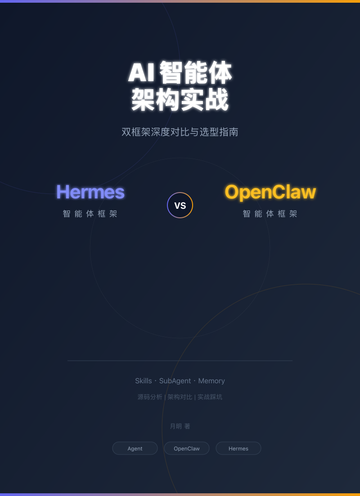

# AI 智能体架构实战
## Hermes + OpenClaw 双框架深度对比与选型指南



---

深入对比 Hermes 和 OpenClaw 两大 AI Agent 框架在 **Skills、SubAgent、Memory** 三大核心系统上的设计差异和实战表现。

---

## 章节导航

### [第一章：Hermes 的三大核心问题](./ch01-hermes-memory-disorder.md)

从两周真实使用经历出发，概览 Hermes 的三个核心问题：
- Skills 系统灾难（多 Skill 互相踩、越积越多没人管）
- 记忆紊乱（旧事重现、新记忆不生效）
- SubAgent 任务中断

---

### [第二章：Skills 系统对比](./ch02-skills-comparison.md)

Hermes Skills 的 5 个系统性问题 + OpenClaw Skills 体系分析：
- 经验 ≠ 技能（门槛过低）
- 无负熵机制（只增不减）
- 无组合机制（孤岛效应）
- 无冲突检测（只查名字）
- 无使用追踪（黑盒子）

附 SKILL 格式实战干货。

---

### [第三章：SubAgent 机制对比](./ch03-subagent-comparison.md)

分析 Hermes 的 SubAgent 机制：
- **claude-code 和 codex 是内置 tool，不是 skill**
- 真正的问题：外部工具调用，而不是真正的 Session 隔离委托
- OpenClaw sessions_spawn + ACP 的完整 spawn 链
- Child 超时不自杀、Stream relay 数据丢失等坑位

附 Chain/Fan-out/Tree 三种编排模式流程图。

---

### [第四章：Memory 系统对比](./ch04-memory-comparison.md)

基于源码分析，揭示 Memory 紊乱的真正根因：
- **MEMORY.md 超载**：2996 chars > 2200 限制
- **flush_memories 误写**：Context Compression 把旧信息写入 memory
- **nudge_interval=10**：Background Review 每 10 轮触发，累积效应显著
- **三层次上下文结构**：系统级、Session、对话历史

Hermes vs OpenClaw 完整对比表 + 架构图。

---

### [第五章：选型建议与避坑指南](./ch05-selection-guide.md)

实战者的决策手册：
- 快速选型决策树
- Hermes/OpenClaw 各适用场景
- 完整的避坑速查表

---

### [第六章：月明的实践](./ch06-my-practice.md)

OpenClaw 多虾架构落地经验：
- 总管虾 + 5 只虾的分工体系
- 飞书多 Bot 账号配置
- 踩坑总结

---

## Config 目录

独立的 Config/SKILL 文件目录，可被 AI Agent 直接加载运行：

```
Config/
├── HERMES/           # 给 Hermes 用的 SKILL
│   ├── hermes-skills-auto-creation-control.SKILL.md
│   └── hermes-subagent-analysis.SKILL.md
└── OPENCLAW/         # 给 OpenClaw 用的 SKILL
    ├── openclaw-memory-concurrency-guide.SKILL.md
    └── openclaw-sessions-spawn-guide.SKILL.md
```

---

## 来源说明

综合了：
- **Hermes 源码分析**（MemoryManager、MemoryProvider 等）
- **OpenClaw 源码分析**（ACP spawn 链、Memory 系统等）
- **月明的真实实战经历**和踩坑总结
- **源码验证**：所有关键说法标注了源码位置

---

*最后更新：2026-04-26*
