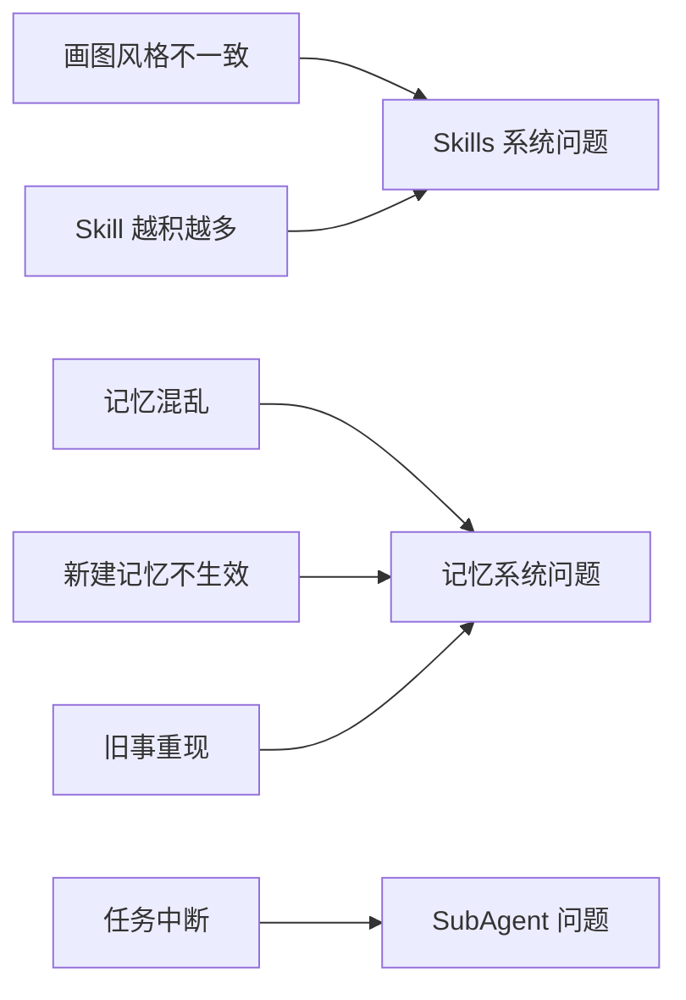
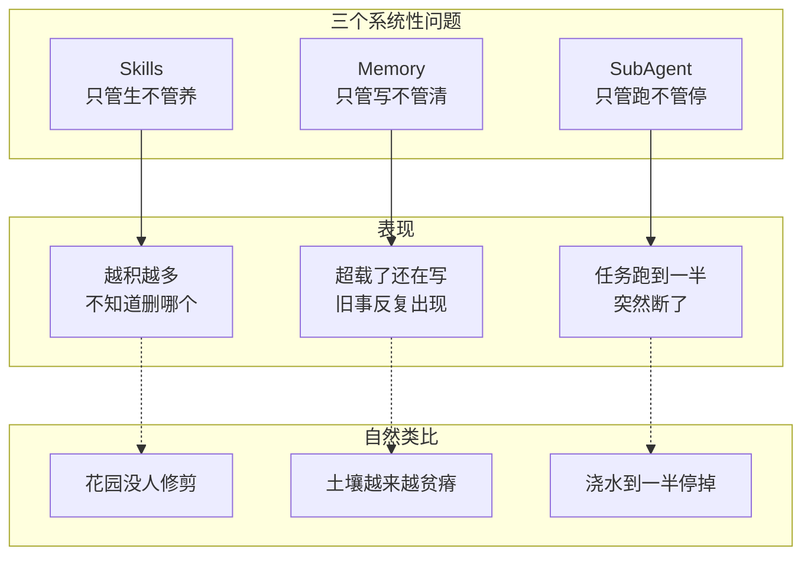

# 第一章：Hermes 的三大核心问题——我的踩坑总结

> 📌 **章节性质说明**
>
> 本章是全书的**总起**，基于月明两周 Hermes 使用经历的**真实踩坑**。
> 每个问题会在后续章节详细展开。

---

## 1.1 先说我的经历

我用了两周 Hermes。

两周时间里，Hermes 帮我处理了大量工作——写文章、做调研、写代码、回答问题。效率确实高，我越用越依赖它。

但用的时间越长，问题也开始暴露出来。

**问题开始出现的时候，是在我让它连续做了几个任务之后。**

---

## 1.2 问题是怎么发现的

### 第一天：画图风格不一致

第一天我让 Hermes 给我生一批配图，总共 8 张。

我预期的结果是一套风格统一的图——就像同一个设计师的作品。但实际出来的 8 张图，让我怀疑这不是同一个人画的：

- 图1：扁平风格，蓝色主调
- 图2：写实风格，灰色调
- 图3：手绘风格，线条粗犷
- 图4-8：各有各的问题

我的第一反应是：工具出问题了？模型不统一？

检查了一圈，发现模型是同一个。

问题不在模型，在 Hermes 本身。

### 第三天：Skill 越积越多

用到第三天，我开始注意到一个问题——Skills 目录越来越大了。

Hermes 会根据我的使用情况自动创建 Skill。有些是我让它记住的流程，有些是它自己判断"这个任务模式值得保留"而创建的。

我打开 Skills 目录一看，发现已经有几十个 Skill 了，其中绘图相关的就有 4 个。

这 4 个绘图 Skill 什么关系？互相踩。同样一个"画一张图"的请求，每次选到的 Skill 不同，结果风格完全不同。

### 第五天：记忆开始混乱

这是最让我头疼的。

新建的记忆，下一个问题里就没了。但几天前被否定的方案，突然又冒出来。

我明明说过"以后这种图用扁平化风格"，下一个问题它又选了另一种风格。

更奇怪的是，有时候它会"记起"一些我从来没说过的内容——或者是我说过、但后来明确否定了的内容。

---

## 1.3 三个核心问题

两周时间，我踩出了三个大类的问题：



### 问题一：Skills 系统灾难

**表现：** 多 Skill 互相踩、越积越多没人管

4 个绘图 Skill 功能重叠，Hermes 选 Skill 的逻辑是随机的——看关键词、看近期提及、看心情，不是看哪个最适合。

更严重的是，没有使用追踪。我不知道哪些 Skill 真的被用过、哪些从没触发过、哪些已经过时了。

### 问题二：记忆紊乱

**表现：** 新记忆不生效，旧事莫名重现

新建的记忆在下一个问题里消失了，但几天前被否定的方案又冒出来了。

后来 Hermes 自己诊断，发现是 MEMORY.md 超出限制，加上 Context Compression 机制在长会话时误写，导致旧信息被固化。

### 问题三：SubAgent 任务中断

**表现：** 任务跑到一半断了，状态不一致

用 Hermes 的 claude-code tool 执行多步任务，结果任务跑到一半被打断，返回值不完整。

原因是 Hermes 的"SubAgent"其实是外部工具调用，不是真正的 Session 隔离委托。

---

## 1.4 三个问题的概览

| 问题 | 表现 | 根因 |
|------|------|------|
| Skills 灾难 | 多 Skill 互相踩、越积越多没人管 | 无负熵机制、无使用追踪 |
| 记忆紊乱 | 旧事重现、新记忆不生效 | MEMORY.md 超载 + Context Compression 误写 |
| SubAgent 中断 | 任务跑到一半断了，状态不一致 | 无 Parent-Child Session 隔离 |

---

## 1.5 类比：Hermes 是一个"只管生不管养"的系统



- **Skills**：花园里自己长出来的植物，没有园丁修剪
- **Memory**：花园里的土壤，越用越贫瘠但没施肥清理
- **SubAgent**：花园里的自动浇水装置，浇到一半会突然停

---

## 1.6 详细分析在后面

本章是引子，后面有详细分析：

- **第二章**：Skills 系统深度分析 + 解决方案
- **第三章**：SubAgent 机制分析 + OpenClaw ACP 对比
- **第四章**：Memory 系统深度分析 + OpenClaw Memory 对比

---

## 1.7 解决方案概览

| 问题 | 解决方案 |
|------|---------|
| Skills 灾难 | 关闭 auto-creation + 定期 review + 达尔文技能优化 |
| 记忆紊乱 | 调高 nudge_interval + 清理 MEMORY.md + 定期检查 |
| SubAgent 中断 | 用 OpenClaw ACP sessions_spawn 代替 Hermes claude-code |

---

## 1.8 自检命令

```bash
# 检查 MEMORY.md 大小
wc -c ~/.hermes/memories/MEMORY.md

# 检查 Skills 数量
find ~/.hermes/skills/ -name "SKILL.md" | wc -l

# 检查当前 memory 配置
grep -A5 "memory:" ~/.hermes/config.yaml
```
