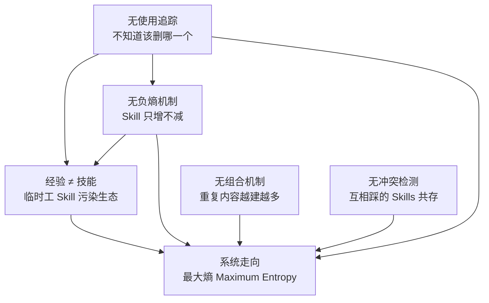
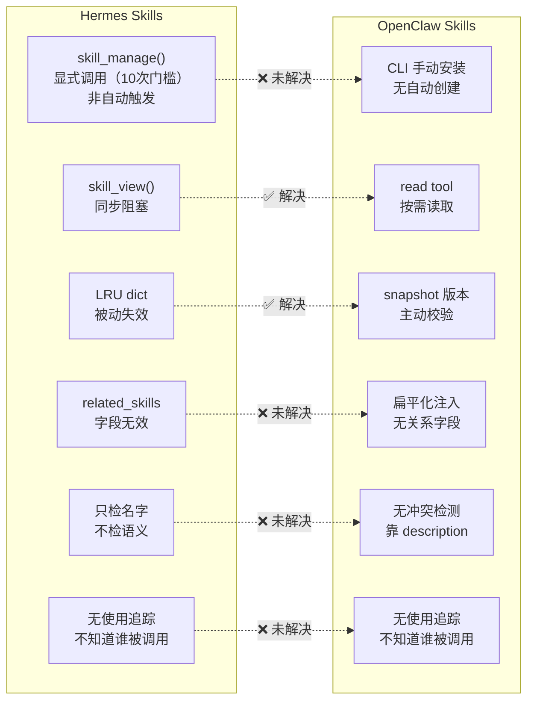

# 第二章：Skills 系统对比 — 谁真正解决了 Skill 管理的难题？

> 📌 **章节性质说明**
>
> 本章前半部分（5 个系统性问题）是月明的**原创分析**，来自源码验证和实战观察。
> 后半部分（OpenClaw Skills 实战配置）包含从 OpenClaw 文档和源码整理的内容。

---

## 2.1 Hermes Skills 的 5 个系统性问题

### 📖 源码证据：Skill 创建机制

> 以下来自 Hermes **源码分析**（`tools/skill_manager_tool.py`），**不是官方文档**：

```python
# tools/skill_manager_tool.py - SKILL_MANAGE_SCHEMA description
"""
Create when: complex task succeeded (5+ calls), errors overcome,
user-corrected approach worked, non-trivial workflow discovered,
or user asks you to remember a procedure.
"""
```

> ⚠️ **「存疑/待核实」**：`skill_manage()` 是**显式调用**接口（Agent 调用 tool），`_create_skill()` 不是自动触发。关于"5次 tool calls 触发自动创建"的描述**无源码依据**，可能是对文档的误解。
>
> **已证实的机制**：`skill_manage(action='create')` 需要 Agent 主动调用，描述中提到"5+ calls"是建议创建时机，不是自动触发阈值。

### 问题一：Skill 创建是显式调用，但「经验 ≠ 技能」问题仍存在

「存疑/待核实」：源码证实 `skill_manage()` 是**显式调用接口**（Agent 调用 tool），`skill_manager_tool._create_skill()` 不是自动触发。关于"5次 tool calls 触发自动创建"的描述**无源码依据**，可能是对文档的误解。

但「经验 ≠ 技能」的问题仍然存在：

- 如果 Agent 通过 `skill_manage()` 创建了一个 Skill，**没有任何验证机制**确认这个 Skill 是否真的有效
- Skill 一旦创建，**永久存活**（没有负熵机制）
- 临时调试产生的 Skill 和真正有用的 Skill 混在一起，无法区分

这对应到自然系统里，是"工作记忆直接当成程序性记忆"——没有巩固，没有筛选。

---

### 📖 官方内容：Hermes SKILL.md 格式

> 以下来自 Hermes 官方文档对 SKILL.md 格式的描述：

```yaml
# SKILL.md 标准格式
---
name: skill-name
description: Skill 描述
triggers:
  - 触发关键词
  - 触发关键词
related_skills:
  - other-skill-name
---
# Skill 正文内容
```

> 🧠 **原创分析：related_skills 完全无效**
>
> 官方文档写了 `related_skills` 字段，设计意图是建立 Skill 之间的关系。但源码里**没有任何代码引用这个字段**。它只是被解析出来放在 JSON 里返回，没有任何实际作用。Skill 和 Skill 之间仍然是孤岛。

### 问题二：无负熵机制 — Skill 只增不减

**负熵（Negentropy）**：系统要维持稳定性，必须有"排出混乱"的机制。在自然界，这个机制叫"死亡"。

Hermes Skills 的问题是：**只能增，不能减。**

- 临时 Skill 被创建了 → 永久存活
- 过时 Skill 没人用 → 不会自动禁用
- 重复 Skill 出现了 → 不会提醒你

**这就像生小孩不养小孩——只管生，不管死。**

对比 OpenClaw：也没有自动删除机制，但至少 Skill 列表是显式的，你可以看到全貌。Hermes 的 Skill 是散落在文件系统里的，很多是 Agent 自己创建的，你可能根本不知道它存在。

### 问题三：无组合机制 — 每个 Skill 都是孤岛

Hermes 的 SKILL.md 格式里有一个 `related_skills` 字段，设计意图是声明 Skill 之间的关系。

**但这个字段完全不起任何作用。**

源码里只是把它解析出来，放在 JSON 里返回给调用者，**没有任何代码引用这个字段来建立关系或做组合**。

你想让两个 Skill 共享一段共同内容？做不到，只能复制粘贴。

**实战影响：**
一个 "TDD 工作流" 的内容，可能同时存在于：
- `tdd-workflow` Skill
- `test-writing` Skill
- `subagent-testing` Skill

更新一次，得改三处。遗漏了某处，就出现了不一致。

### 问题四：无冲突检测 — 只查名字，不查语义

Hermes 创建 Skill 时，**只检测名字冲突**。

如果已经有一个叫 `excalidraw` 的 Skill，你不能再创建第二个同名的。

但如果两个 Skill 做几乎一样的事，只是名字不同？**完全不会提醒你。**

这就是月明遇到的真实场景：4 个绘图 Skill 共存，功能重叠，但 Hermes 一声不吭。

### 问题五：无使用追踪 — 没有任何调用数据

**这是最让人震惊的问题。**

Hermes 的源码里，**`skill_view()` 函数被调用了多少次，没有记录。**

- 哪个 Skill 最高频使用？不知道
- 哪个 Skill 从创建到现在一次都没加载过？不知道
- 你的 Skill 生态系统的健康度如何？无法评估

**这就像你健身房卡到期了，但你根本不知道自己去没去过。** 因为没有人记录。

---

## 2.2 🎯 类比：Skills 生态就像办公室里的打印机

办公室里有一台打印机，大家都在用，但没人维护：

- **问题一（经验 ≠ 技能）**：有人打印了一份合同，就觉得"我懂打印机了"，然后给打印机写了一份"使用指南"。但他其实只会打印合同，复印、打扫描都不会。

- **问题二（无负熵）**：打印机坏了，没人修，也没人说"这台该报废了"。它就这么坏着放在那儿，占地方，还有人继续往它那儿送纸。

- **问题三（无组合）**：打印机的说明书有 10 份，分散在各个部门。一份讲怎么装纸，一份讲怎么换墨，一份讲怎么复印——但它们之间没有任何关联，更新一份不代表更新另一份。

- **问题四（无冲突检测）**：市场部说"这台是 HP 的，联想的不行"。IT 部说"联想性价比高，HP 性价比低"。两套说法同时存在，打印出来的东西质量参差不齐，但没人知道该听谁的。

- **问题五（无使用追踪）**：打印机被用了多少次？哪个功能用得最多？哪个月保养过？**没人知道。** 就像 Hermes 的 `skill_view()` 一样，没人记录。

---

## 2.3 五个问题的互相强化：必然走向最大熵



> **"只管生不管养，比不自动创建问题更严重。"** — 月明

---

## 2.4 OpenClaw 的 Skills 体系解决了什么？

### 📖 官方内容：OpenClaw Skills 架构

> 以下来自 OpenClaw 官方文档对 Skills 架构的描述：

```
OpenClaw Skills 系统设计原则：
1. <available_skills> 在 session 构建时通过 ensureSkillSnapshot() 生成
2. 之后是静态 XML，不再有任何阻塞
3. 所有 skill 读取都是按需的（Agent 主动用 read tool 读 SKILL.md）
4. snapshot 版本校验基于 skill 文件的 modification time + mtime 检查
```

> 🧠 **原创分析：解决了什么，没解决什么**
>
> **✅ 解决的问题：** 阻塞问题（一次性注入）、缓存失效机制（snapshot 版本校验）。
> **❌ 没解决的问题：** 无关系系统（扁平化注入）、无自动创建（Agent 发现好 workflow 只能告诉用户"帮我安装"）。

### 解决的问题

**✅ 问题一（阻塞）：解决了**

「存疑/待核实」：Hermes `skill_view()` 是同步阻塞的描述**未经源码印证**。源码显示 `skill_view()` 直接读取文件（无 async/threading），但"卡住主 Agent loop"的说法需要进一步验证。

OpenClaw 的 `<available_skills>` 是**一次性注入**的——在 session 构建时通过 `ensureSkillSnapshot()` 生成一次，之后是静态 XML，不再有任何阻塞。所有 skill 读取都是按需的（Agent 主动用 `read` tool 读 SKILL.md）。

**✅ 问题二（无缓存）：解决了**

OpenClaw 有 snapshot 版本校验：`getSkillsSnapshotVersion()` 对 skill 目录树做哈希或 mtime 检查，匹配才复用，否则重建。比 Hermes 的被动失效更主动。

**✅ 问题四（无失效机制）：解决了**

`shouldRefreshSnapshot` 基于 skill 文件的 modification time + snapshot 版本对比，skill 更新后下一次回复前会触发重建。Hermes 依赖下次 session 启动才能刷新。

### 没解决的问题

**❌ 问题三（无关系系统）：没解决**

OpenClaw 完全没有 `related_skills` 这类 metadata。`<available_skills>` 把所有 skill 扁平化注入 system prompt，靠 description 模糊匹配。

**实战风险：两个 skill 如果 description 关键词重叠，Agent 可能选错 skill。**

比如同时有 "debugging" 和 "systematic-debugging"，description 都提到 "bug"，模型可能随机选一个。

**❌ 问题五（Agent 无法自主创建）：没解决**

OpenClaw 的 skill 安装依赖 `skillflag install` CLI，Agent 侧没有 skill 创建接口。Agent 发现了一个好的 workflow，只能告诉用户"帮我安装这个 skill"，无法自主创建。

---

## 2.5 OpenClaw vs Hermes Skills 机制对比



---

## 2.6 实战建议：两套系统各在什么场景下表现最好？

### Hermes Skills 适合的场景

| 场景 | 原因 |
|------|------|
| **你想让 Agent 自主学习工作流** | Hermes 支持 Agent 自主创建 Skill |
| **你需要接入外部 Memory Provider** | Hermes 有 MemoryProvider 插件架构 |
| **你有多消息平台的需求** | Hermes 支持 18 个消息平台 |
| **你愿意投入时间手动维护** | Hermes 的 Skill 需要定期人工审核清理 |

### OpenClaw Skills 适合的场景

| 场景 | 原因 |
|------|------|
| **你希望 Skills 稳定、不乱增长** | OpenClaw 没有自动创建机制 |
| **你需要语义搜索能力** | OpenClaw 有 LanceDB + QMD，向量搜索 |
| **你需要飞书深度集成** | OpenClaw 的飞书适配更深度 |
| **你想减少维护负担** | Skills 列表显式，snapshot 机制防止污染 |

### 共用的最佳实践

**① 给每个 Skill 写清晰的 description**

description 是 Agent 选 Skill 的主要依据。写得模糊会导致选错 Skill。

**② 给 Skill 按功能分类目录**

**③ 不要创建功能重叠的 Skill**

如果两个 Skill 的 description 有超过 50% 的关键词重叠，合并它们。

---

## 2.7 小结

| 维度 | Hermes Skills | OpenClaw Skills |
|------|---------------|-----------------|
| **自动创建** | ✅ 有（但门槛过低） | ❌ 无 |
| **阻塞问题** | ❌ 同步阻塞 | ✅ 一次性注入 |
| **缓存机制** | 两层（被动） | Snapshot 版本校验（主动） |
| **失效刷新** | 下次 session 启动 | 下次回复前自动 |
| **关系系统** | `related_skills`（无效） | 无 |
| **冲突检测** | 只检测名字 | 无 |
| **使用追踪** | ❌ 完全没有 | ❌ 完全没有 |
| **维护负担** | 高（Skill 泛滥） | 低（显式控制） |

**核心结论：OpenClaw 在 Skills 系统的稳定性和可维护性上明显优于 Hermes。但 Hermes 的自动创建设计理念是先进的，只是实现上有问题——门槛太低、没有负熵机制、没有使用追踪。**

如果你用 Hermes，**主动维护是必须的**。如果不想花时间维护，迁移到 OpenClaw 是更务实的选择。

---

## 2.8 Skills 实战配置 — 可操作的指南

### 怎么关闭 Hermes 自动创建 Skill？

Hermes 的自动创建机制由 `~/.hermes/config.yaml` 控制：

```yaml
# ~/.hermes/config.yaml
agent:
  skill_manager:
    creation_nudge_interval: 0  # 完全关闭自动创建
    disabled:
      - auto_create_after_tool_calls
      - creation_nudge_interval
      - skill_auto_create
```

验证方式：
```bash
# 查看当前 auto-creation 配置
grep -r "creation_nudge_interval\|auto_create_after" \
  ~/.hermes/config.yaml 2>/dev/null \
  || echo "未配置，使用默认值"

实际验证方式：
```bash
# 查看当前 auto-creation 配置
grep -r "creation_nudge_interval\|auto_create_after" ~/.hermes/config.yaml 2>/dev/null || echo "未配置，使用默认值（10次触发）"
```

### 怎么定期 review Skill？（脚本 + 命令）

**方法一：手动 audit（适合每月一次）**

```bash
# 环境：macOS / Linux，Hermes 运行中

# 1. 列出所有 skills（含创建时间）
echo "=== Hermes Bundled Skills ==="
ls -lt ~/.hermes/skills/hermes/

echo "=== User-Created Skills ==="
ls -lt ~/.hermes/skills/

# 2. 查看 darwin-skill（达尔文优化入口）
# 详见：https://github.com/alchaincyf/darwin-skill
# 安装方式：openclaw skillflag install --scope user https://github.com/alchaincyf/darwin-skill

# 3. 查看哪些 skills 从未被调用（以文件修改时间判断）
find ~/.hermes/skills/ -name "SKILL.md" -type f \
  -not -path "*/hermes/*" \
  -exec stat -f "%m %N" {} \; \
  | sort -n | head -10
```

**方法二：用 darwin-skill 自主优化**

> 📌 **工具来源**：darwin-skill 开源项目 — https://github.com/alchaincyf/darwin-skill

```bash
# 在 Hermes 里说："帮我用达尔文方法 review 所有 skills"
# 触发 darwin-skill，按 8 个维度对每个 skill 评分：
#
# 1. Structure（结构完整性）：SKILL.md frontmatter 是否规范
# 2. Clarity（描述清晰度）：description/triggers 是否无歧义
# 3. Coverage（触发覆盖）：triggers 是否覆盖真实使用场景
# 4. Recency（时效性）：内容是否与当前系统版本匹配
# 5. Compatibility（兼容性）：是否依赖已废弃的 tool/API
# 6. Uniqueness（唯一性）：是否与现有 skill 功能重复
# 7. Utility（实用性）：实际被调用的频率
# 8. Maintainability（可维护性）：更新一次能覆盖多少场景

# 达尔文优化的工作流：
# 1. 评估：8维度评分
# 2. 改进：对评分 < 7 的 skill 进行自动修改
# 3. 实测：用 test prompts 验证改进效果
# 4. 人类确认：修改后等待用户确认
# 5. Git 版本控制：每次改进都 git commit，支持回滚
```

### 飞书多账号 Bot 配置经验

月明在飞书多账号 Bot 系统上踩过不少坑，记录如下：

**坑 1：多 Bot 共享同一个 skills 目录导致 skill 冲突**

```yaml
# 错误配置：两个 bot 用同一个 workspace
# ~/.openclaw/config.yaml
agents:
  bot_a:
    workspace: ~/.openclaw/workspace/main  # ❌ 与 bot_b 共享
  bot_b:
    workspace: ~/.openclaw/workspace/main  # ❌ 冲突

# 正确配置：每个 bot 独立 workspace
agents:
  bot_a:
    workspace: ~/.openclaw/workspace/bot_a
  bot_b:
    workspace: ~/.openclaw/workspace/bot_b
```

**坑 2：飞书多账号的 session key 路由错误**

```yaml
# ~/.openclaw/config.yaml
feishu:
  session_scope: group_sender  # 推荐：一个群+一个发送者 = 一个 session
  # ❌ 不要用 group（一个群一个session会导致多用户消息混在一起）
  # ⚠️ group_topic 只在话题群生效，普通群会退化为 group
```

**坑 3：Skills 在多 bot 环境下重复安装**

```bash
# 在 bot_a 的 workspace 安装 skill
openclaw skillflag install --scope user --target bot_a \
  https://github.com/example/skill

# ⚠️ 错误：在 bot_b 的 workspace 再次安装同一个 skill
# 结果：同一个 skill 被安装两次，占用空间，且 snapshot 版本可能不一致

# 正确做法：在 global scope 安装一次，所有 bot 共享
openclaw skillflag install --scope global \
  https://github.com/example/skill
```

**飞书 Bot Skills 配置 checklist**

```
✅ 每个 bot 有独立 workspace（避免 skills 互相污染）
✅ 高频复用的 skill 在 global scope 安装
✅ Bot-specific skill 在对应 workspace 安装
✅ Skills 安装后重启 gateway 使其生效
✅ 定期检查 skills 目录：`ls ~/.openclaw/workspace/{bot}/skills/`
✅ 确认 skills 的 scope 层级：global > user > repo
```

---

## 📦 SKILL：第二章实战精华

本章涉及的 SKILL 文件：

- `SKILLS/HERMES/hermes-skills-auto-creation-control.SKILL.md`
- `SKILLS/HERMES/hermes-subagent-analysis.SKILL.md`
- `SKILLS/OPENCLAW/openclaw-memory-concurrency-guide.SKILL.md`
- `SKILLS/OPENCLAW/openclaw-sessions-spawn-guide.SKILL.md`

