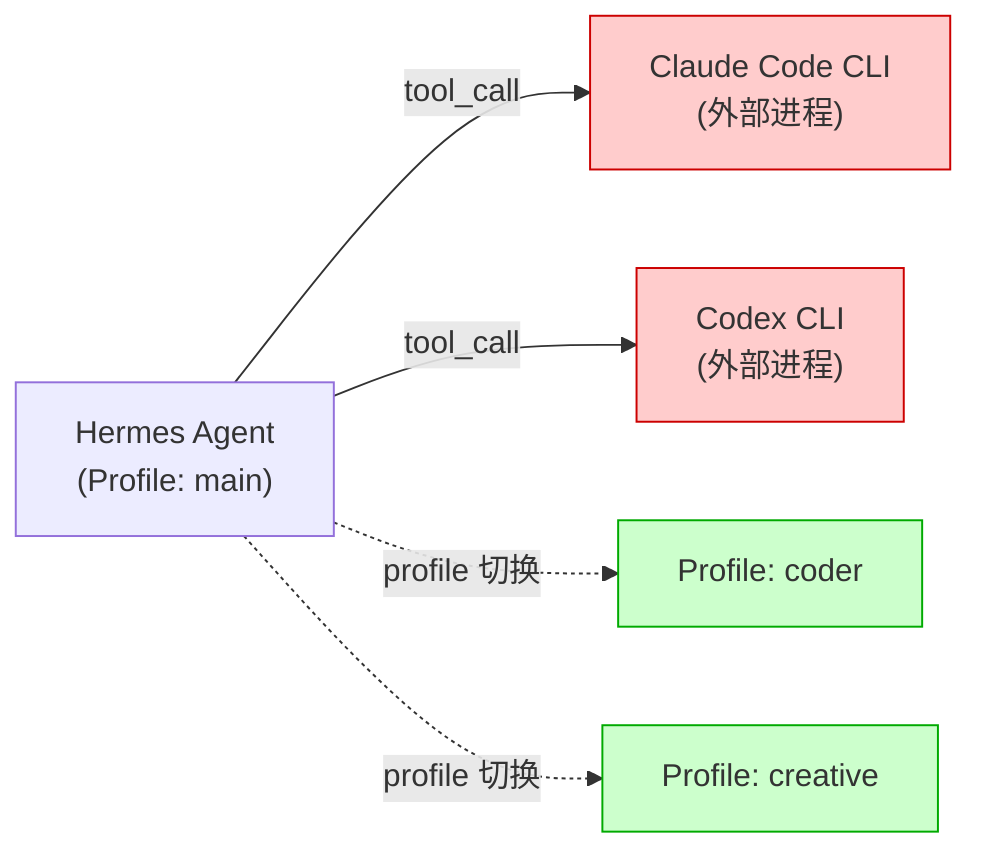
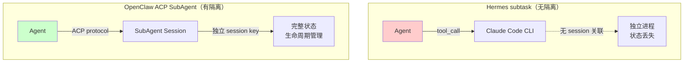
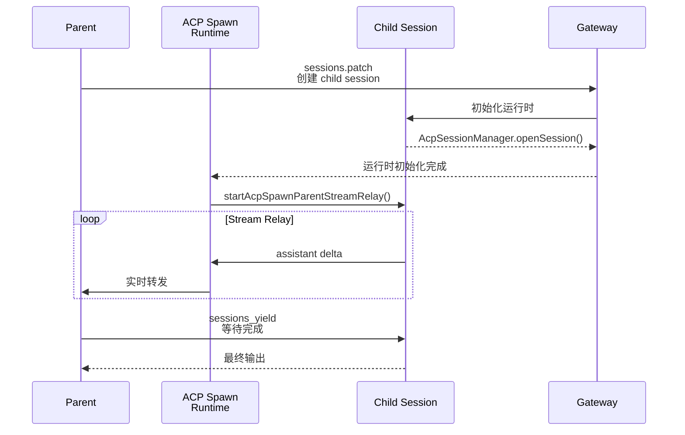
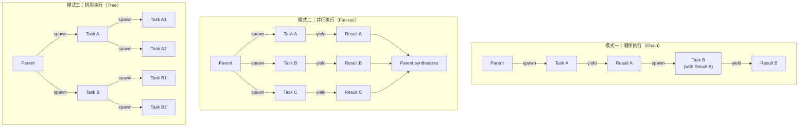

# 第三章：SubAgent 机制对比 — 外部工具调用 vs 真正的 Session 隔离委托

> 📌 **章节性质说明**
>
> 本章大量内容基于源码分析（OpenClaw ACP spawn 链、Hermes profile 机制、claude-code tool 实现），属于**原创分析**。
> 关于 Hermes profile 机制的澄清、以及 claude-code/codex 作为内置 tool 而非 skill 的区分，有官方源码参考。根因分析和坑位描述以原创为主。

---

## 3.1 Hermes 的 Profile 机制

很多人以为 Hermes "根本没有 SubAgent"，但实际上 Hermes 有 profile 机制。

Hermes 有 **profile 机制**，可以通过不同 profile 实现不同角色的 Agent：

```bash
# ~/.hermes/profiles/
├── main/          # 主 Agent（猪猪虾）
├── coder/         # 编程 Agent（coder虾）
└── creative/       # 创意 Agent（芝士虾）
```

每个 profile 有独立的配置、skills 和行为模式。**这本身就是一种多 Agent 协作方式。**

---

## 3.2 Hermes 的 "SubAgent"：claude-code / codex 工具

### claude-code 和 codex 的实际形态

`claude-code` 和 `codex` 是 Hermes **内置的 tool 实现**（在 `tools/` 目录下），不是 `~/.hermes/skills/` 里的 SKILL.md 文件。

```
Hermes Agent 源码
└── tools/
    ├── claude_code_tool.py   ← 内置 tool，不是 skill
    └── codex_tool.py          ← 内置 tool，不是 skill
```

它们的使用方式是 `tool_call`，调用外部 CLI 进程：
- 没有 session key
- 没有流式转发（streaming relay）
- 没有生命周期管理

### Hermes 真正的 SubAgent 架构图



**真正的问题：这些是"外部工具调用"而不是"真正的 Session 隔离委托"。**

---

## 3.3 Hermes Skills 目录全解析

### 📁 三大目录必须分清

```bash
~/.hermes/skills/
├── hermes/          # Hermes 官方/Bundled Skills（来自 hermes-agent 源码包）
│   ├── skills-diagnosis/SKILL.md
│   ├── skills-judgment/SKILL.md
│   ├── hermes-approval-debugging/SKILL.md
│   └── ...（共10个官方 skill）
│
├── mcp/             # MCP 协议集成
│   ├── mcporter/
│   └── native-mcp/
│
**Skills 目录结构：**


~/.hermes/skills/
├── hermes/                      # Hermes 官方/Bundled Skills
│   ├── skills-diagnosis/
│   ├── skills-judgment/
│   ├── hermes-approval-debugging/
│   └── ...（共10个官方 skill）
├── mcp/                          # MCP 协议集成
│   ├── mcporter/
│   └── native-mcp/
└── [user-created]/               # 用户创建的 Skills
    └── ...（数量因使用情况而异）
```

**补充说明：** `claude-code` 和 `codex` 不在 `~/.hermes/skills/` 里。它们是内置 tool，实现位于 `tools/` 目录下。

---

## 3.4 Hermes 的 subtask 中断问题

### 什么是 subtask 中断？

"subtask 中断"指的是：当你在 Hermes 里发起一个多步任务（通过 claude-code 或 codex），如果任务执行到一半被打断（用户取消、消息超时、外部信号），任务的执行结果和状态会出现不一致。

**典型场景：**

1. 你让 Hermes 调用 `claude-code` 执行一个代码重构任务
2. claude-code 正在跑 `git commit`，还没提交完
3. 用户发了新消息，或者飞书连接断了
4. Hermes 的 tool call 返回了，但返回值可能是不完整的
5. 主 Agent 拿到不完整的返回值，继续执行，导致状态不一致

### 根因：没有 Parent-Child Session 隔离



Hermes 的"subtask"（通过 claude-code tool 调用）是**没有任何 session 关联**的。

- 没有流式转发（streaming relay）
- 没有状态同步机制
- 中断后状态丢失

OpenClaw 的 ACP subagent 有完整的 session 隔离。

### 📖 官方内容：on_delegation 钩子

> 以下来自 Hermes 源码注释（代表了设计意图，但非官方文档）：

```python
def on_delegation(self, task: str, result: str, *,
                  child_session_id: str = "", **kwargs) -> None:
    """Called on the PARENT agent when a subagent completes.

    This is a hook for observing subagent work — it gives the memory
    provider observation of what was delegated and what came back.
    The subagent's own memory is managed independently by that agent.
    """
    pass  # Default implementation does nothing
```

> 🧠 **原创分析：钩子 ≠ 协调机制**
>
> **设计意图：让 Memory Provider 知道"有 subagent 完成了工作"。**
>
> **实际情况：没有任何实际的协调逻辑。** 如果你想在 Hermes 里实现"等 subagent 做完这件事，再执行下一个任务"，你得自己写这个逻辑，Hermes 没有提供。这个钩子只是一个"观察哨"，不是协调器。

---

## 3.5 🎯 类比：Hermes SubTask 就像让孩子独自去超市买东西

想象你让孩子去超市买牛奶：

**OpenClaw ACP SubAgent 的方式：**
- 你给孩子一张纸条（session key）
- 超市员工（SubAgent）按纸条记录孩子买了什么
- 你在家里实时收到孩子买牛奶的进度（stream relay）
- 买完了你回家验收（sessions_yield）

**Hermes claude-code 的方式：**
- 你把孩子往超市门口一放（tool_call）
- 你不知道孩子走到哪儿了（无 stream relay）
- 孩子买没买到、买了什么，你只能等他回来说（返回值可能不完整）
- 如果孩子中途被截走（中断），你就不知道结果了

**Hermes 的 subtask 是"放养模式"，不是"放手上牵着走"。**

---

## 3.6 OpenClaw 的 sessions_spawn + ACP 实际表现

### 完整的 spawn 链



### Session Key 格式完全隔离 parent 和 child

```
parent session:  agent:main:session:${uuid}
child session:  agent:${targetAgentId}:acp:${uuid}
```

### 流式转发（Stream Relay）机制

`startAcpSpawnParentStreamRelay()` 负责把 child 的 assistant delta 实时转发回 parent session。

**工作方式：**
1. Child 每次有 assistant 输出（delta），发送给 relay
2. Relay 把 delta 写入 `.acp-stream.jsonl`（持久化）
3. 同时把 delta 转发给 parent session
4. Parent 的 UI 可以实时看到 child 的执行过程

**这比 Hermes 的 tool_call 模式体验好很多**——你能看到子 Agent 正在做什么，而不是等它全部完成才能看到结果。

---

## 3.7 OpenClaw 的坑：Child 超时不自杀

### 📖 官方内容：ACP 超时配置

> 以下来自 OpenClaw 官方文档对超时配置的描述：

```
ACP SubAgent 超时配置：
- noOutputNoticeMs: 无输出多久后发通知
- maxRelayLifetimeMs: 最大 relay 生命周期
- Child 进程在超时时会被监控，但不保证强制 kill
```

> 🧠 **原创分析：监控 ≠ kill**
>
> 官方写了"监控"，但没写"kill"。实际上**有监控无 kill**。Child 进入死循环或长时间无输出，Parent 只能等到 gateway 重启，Child 变成孤儿进程继续占用资源。

### 坑位速查

| 坑 | 描述 | 影响 |
|----|------|------|
| **Child 超时不自杀** | noOutputNoticeMs/maxRelayLifetimeMs 有监控但无强制 kill | 孤儿进程占用资源 |
| **Stream relay 数据丢失** | relayBuffer 在内存中，没写盘就崩溃就丢了 | 重要任务的中间结果丢失 |
| **飞书并发 Spawn 冲突** | <100ms 内两次 spawn 共享 thread_id | 流混在一起 |
| **spawn 后没有 yield** | Agent 调用 sessions_spawn 但不调用 sessions_yield | 不知道任务结果 |
| **ACP 桥接 Claude Code** | 格式不兼容，多模态 content 丢失 | 复杂任务不可用 |

### 定期清理 sessions 的建议

OpenClaw 的 sessions 文件（包括 dreaming sessions、.acp-stream.jsonl 等）不会自动清理，长期运行后会占用大量磁盘空间。**建议给 OpenClaw 创建定时任务，自动清理过期 sessions：**

```bash
# 定期清理 OpenClaw sessions（建议每周一次）
# 清理超过 30 天的 dreaming session 和孤儿 stream 文件

# 1. 清理 dreaming sessions
find ~/.openclaw/sessions/ -name "*dreaming*" -mtime +30 -delete

# 2. 清理孤儿 .acp-stream.jsonl 文件（对应 session 已不存在）
# 需要写脚本对比 sessions 目录和 stream 文件的 session key

# 3. 清理过大的 session transcript 文件（> 1MB 的 .jsonl）
find ~/.openclaw/sessions/ -name "*.jsonl" -size +1M -mtime +7 -delete

# 4. 重启 gateway 使清理生效
openclaw gateway restart
```

> 📌 **建议发给 OpenClaw**：让 OpenClaw 创建一个定时任务（cron job），每周自动执行上述清理脚本，并在 AGENTS.md 或 TOOLS.md 里记录清理频率和保留策略。

---

## 3.8 任务编排模式图解



---

## 3.9 小结

| 维度 | Hermes Profile + claude-code | OpenClaw sessions_spawn + ACP |
|------|------------------------------|-------------------------------|
| **真实存在** | ✅ Profile 机制 + tool_call | ✅ 原生 ACP session spawn |
| **多角色隔离** | ✅ Profile 切换 | ✅ 独立 session key |
| **Parent-Child 隔离** | ❌ 无（tool_call 是外部进程） | ✅ 独立 session key |
| **流式转发** | ❌ 无 | ✅ stream relay |
| **Session 管理** | ❌ 无 | ✅ AcpSessionManager |
| **生命周期管理** | ❌ 无 | ⚠️ 有但不完善（超时不自杀） |
| **外部 CLI 桥接** | ✅ claude-code/codex 内置 tool | ❌ 格式不兼容（acpx） |
| **使用门槛** | 低（工具调用） | 高（需要理解 ACP 协议） |

**核心结论：OpenClaw 的 ACP SubAgent 机制在架构上远比 Hermes 完整（独立 session、流式转发、生命周期管理），但执行层有几个坑（超时不自杀、Stream relay 数据丢失、并发 Spawn 问题）。生产环境用 SubAgent 时，必须有超时机制和结果验证，不能裸依赖 ACP 的默认行为。Hermes 的 profile 机制本身是一种有效的多角色方式，但通过 claude-code tool 的委托缺乏真正的 session 隔离。**

---

## 📦 参考 SKILL

本章涉及的 SKILL 文件：

- `SKILLS/HERMES/hermes-subagent-analysis.SKILL.md` — Hermes SubAgent 机制澄清（profile + claude-code tool）
- `SKILLS/OPENCLAW/openclaw-sessions-spawn-guide.SKILL.md` — OpenClaw ACP spawn 实战指南