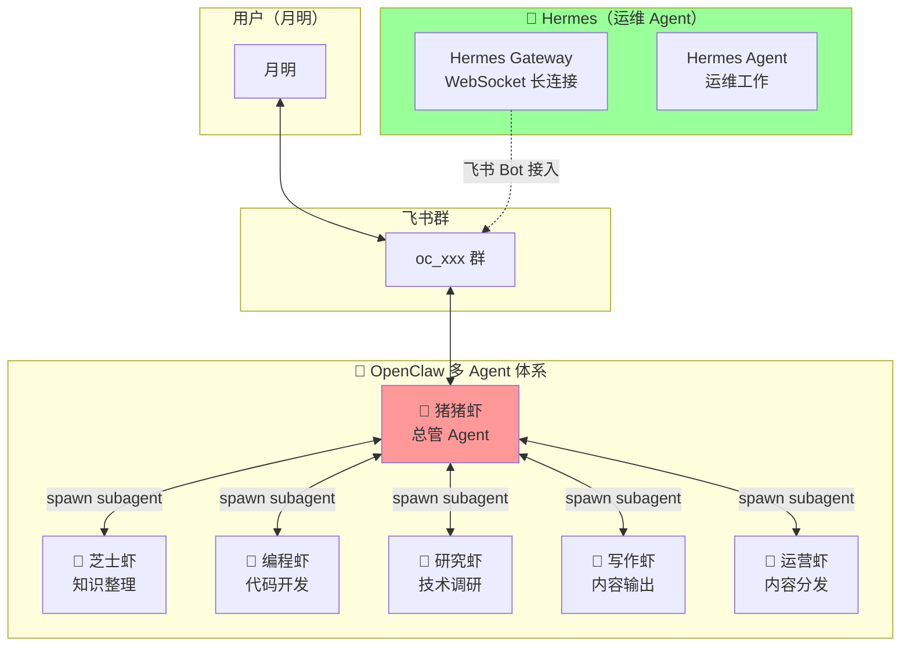

# 第6章：月明的实践——多虾架构落地记

## 架构全貌

我的整体架构是 **OpenClaw 多 Agent 协作 + Hermes 运维接入** 的双轨制：



**关键点：**
- **Hermes 不是虾**，是独立的运维 Agent，负责日常运维工作和飞书 Bot 接入
- **OpenClaw 多 Agent** 是我的核心工作体系，猪猪虾是总管
- 本地 Mac 不暴露任何端口，Hermes 主动连出到飞书

---

## 飞书多 Bot 账号配置

### 账号体系

每个需要直接交互的 Agent 对应一个独立飞书 Bot：

| Agent | 飞书账号 | 角色 | 响应方式 |
|-------|---------|------|---------|
| 🐷 猪猪虾 | default | 总管 | 不用 @，群消息直接响应 |
| 🦐 芝士虾 | zhishi | 知识整理 | 需要 @ 才响应 |
| 🦐 编程虾 | coder | 代码开发 | 需要 @ 才响应 |
| 🦐 研究虾 | research | 技术调研 | 需要 @ 才响应 |
| 🦐 写作虾 | write | 内容输出 | 需要 @ 才响应 |
| 🦐 运营虾 | ops | 内容分发/用户运营 | 需要 @ 才响应 |
| 🤖 Hermes | — | 运维 | 在群内，通过 Hermes Gateway 接入 |

### 配置结构

```json
// ~/.openclaw/openclaw.json
{
  "channels": {
    "feishu": {
      "accounts": {
        "default": {
          "appId": "YOUR_APP_ID",
          "appSecret": "YOUR_APP_SECRET",
          "groupAllowFrom": ["YOUR_GROUP_ID"],
          "groups": {
            "YOUR_GROUP_ID": { "requireMention": false }
          }
        },
        "zhishi": {
          "appId": "YOUR_ZHISHI_APP_ID",
          "appSecret": "YOUR_ZHISHI_APP_SECRET",
          "groupAllowFrom": ["YOUR_GROUP_ID"],
          "groups": {
            "YOUR_GROUP_ID": { "requireMention": true }
          }
        },
        "coder": {
          "appId": "YOUR_CODER_APP_ID",
          "appSecret": "YOUR_CODER_APP_SECRET",
          "groupAllowFrom": ["YOUR_GROUP_ID"],
          "groups": {
            "YOUR_GROUP_ID": { "requireMention": true }
          }
        },
        "ops": {
          "appId": "YOUR_OPS_APP_ID",
          "appSecret": "YOUR_OPS_APP_SECRET",
          "groupAllowFrom": ["YOUR_GROUP_ID"],
          "groups": {
            "YOUR_GROUP_ID": { "requireMention": true }
          }
        },
        "research": {
          "appId": "YOUR_RESEARCH_APP_ID",
          "appSecret": "YOUR_RESEARCH_APP_SECRET",
          "groupAllowFrom": ["YOUR_GROUP_ID"],
          "groups": {
            "YOUR_GROUP_ID": { "requireMention": true }
          }
        },
        "write": {
          "appId": "YOUR_WRITE_APP_ID",
          "appSecret": "YOUR_WRITE_APP_SECRET",
          "groupAllowFrom": ["YOUR_GROUP_ID"],
          "groups": {
            "YOUR_GROUP_ID": { "requireMention": true }
          }
        }
      },
      "bindings": [
        {
          "type": "route",
          "agentId": "zhishi",
          "match": { "channel": "feishu", "accountId": "zhishi" }
        },
        {
          "type": "route",
          "agentId": "coder",
          "match": { "channel": "feishu", "accountId": "coder" }
        },
        {
          "type": "route",
          "agentId": "ops",
          "match": { "channel": "feishu", "accountId": "ops" }
        },
        {
          "type": "route",
          "agentId": "research",
          "match": { "channel": "feishu", "accountId": "research" }
        },
        {
          "type": "route",
          "agentId": "write",
          "match": { "channel": "feishu", "accountId": "write" }
        }
      ]
    }
  }
}
```

### 关键参数说明

| 参数 | 说明 |
|------|------|
| `requireMention: false` | 总管专属，群消息无需 @ 直接响应 |
| `requireMention: true` | 下属 Agent，必须 @ 才会响应 |
| `groupAllowFrom` | 允许 Bot 响应哪些群 |
| `bindings` | agentId → accountId 的路由映射 |

---

## Hermes Gateway 安装（WebSocket 模式）

### 为什么选 WebSocket？

Webhook 模式需要本地暴露公网 HTTP 端口，复杂且不安全。WebSocket 模式下 Hermes 主动连出，无需任何 inbound 端口，苹果电脑在路由器后面也能正常工作。

### 安装步骤

**1. 创建飞书 CLI App**

```bash
lark-cli config init --new
```

在 [飞书开放平台](https://open.feishu.cn/app) 获取 App ID 和 App Secret。

**2. 配置凭据**

```bash
# ~/.hermes/.env
FEISHU_APP_ID=YOUR_APP_ID
FEISHU_APP_SECRET=YOUR_APP_SECRET
FEISHU_DOMAIN=feishu
FEISHU_CONNECTION_MODE=websocket
GATEWAY_ALLOW_ALL_USERS=true
```

**3. 安装 lark-oapi**

```bash
cd ~/.hermes/hermes-agent
uv pip install lark-oapi --python venv/bin/python
```

验证：
```bash
venv/bin/python -c "import lark_oapi; print('OK')"
```

**4. 注册 launchd 自启**

```xml
<?xml version="1.0" encoding="UTF-8"?>
<!DOCTYPE plist PUBLIC "-//Apple//DTD PLIST 1.0//EN">
<plist version="1.0">
<dict>
    <key>Label</key>
    <string>ai.hermes.gateway</string>
    <key>ProgramArguments</key>
    <array>
        <string>/PATH/TO/.hermes/hermes-agent/venv/bin/python</string>
        <string>-m</string>
        <string>hermes_cli.main</string>
        <string>gateway</string>
        <string>run</string>
        <string>--replace</string>
    </array>
    <key>WorkingDirectory</key>
    <string>/PATH/TO/.hermes/hermes-agent</string>
    <key>EnvironmentVariables</key>
    <dict>
        <key>HERMES_HOME</key>
        <string>/PATH/TO/.hermes</string>
    </dict>
    <key>RunAtLoad</key>
    <true/>
    <key>KeepAlive</key>
    <dict>
        <key>SuccessfulExit</key>
        <false/>
    </dict>
</dict>
</plist>
```

**5. 加载并验证**

```bash
launchctl load ~/Library/LaunchAgents/ai.hermes.gateway.plist
tail -5 ~/.hermes/logs/gateway.log
```

看到 `[Lark] [INFO] connected to wss://msg-frontier.feishu.cn/ws/v2?...` 即成功。

---

## 踩坑总结

| 问题 | 原因 | 解决 |
|------|------|------|
| `lark-oapi not installed` | 装到系统 Python 而非 Hermes venv | 用 `uv pip install --python venv/bin/python` |
| `No module named lark_oapi` | venv 路径写成 `.venv` 而非 `venv` | 确认 venv 目录名是 `venv` |
| 飞书连不上 | launchd 读不到 `.env` 变量 | 把 `HERMES_HOME` 写进 plist |
| Gateway 卡住 | 用了前台模式 | 用 `--replace` 参数 |
| 重启后 Bot 没反应 | launchd 加载失败 | 检查 `gateway.error.log` |

---

## 小结

**多虾架构核心要点：**

1. **OpenClaw 多 Agent** 是工作主体，猪猪虾做总管协调
2. **每个 Agent 独立 Bot**：default（总管）、zhishi、coder、research、write、ops，都有自己的飞书 Bot 账号
3. **Hermes 是运维 Agent**，不是虾，负责飞书 Bot 接入和日常运维
4. **多 Bot 账号**隔离：总管不需要 @，下属需要 @
5. **WebSocket 模式**最省心，不需要暴露公网端口
6. **launchd 自启**保证 Gateway 始终在线

---

## 飞书 Bot 权限配置

> ⚠️ **按需配置**：以下 JSON 模板中的权限列表是**最全配置**，实际使用时建议按需删减不需要的权限。
> 请用户自行编辑填入真实权限值。

```json
{
  "scopes": {
    "tenant": [
      "im:chat:read",
      "im:chat:readonly",
      "im:chat.access_event.bot_p2p_chat:read",
      "im:chat.members:bot_access",
      "im:chat.members:read",
      "im:message:readonly",
      "im:message:send_as_bot",
      "im:message.group_at_msg:readonly",
      "im:message.group_at_msg.include_bot:readonly",
      "im:message.p2p_msg:readonly",
      "im:resource",
      "application:bot.basic_info:read",
      "application:bot.menu:readonly",
      "cardkit:card:read",
      "cardkit:card:write",
      "cardkit:template:read",
      "contact:user.base:readonly",
      "contact:user.email:readonly",
      "contact:user.id:readonly",
      "contact:user.phone:readonly",
      "contact:department.base:readonly",
      "directory:department.base:read",
      "directory:employee.base:read",
      "directory:employee.work:read",
      "docs:doc:readonly",
      "docs:document.content:read",
      "sheets:spreadsheet:readonly",
      "base:app:read",
      "base:app:readonly",
      "base:table:read",
      "base:record:read",
      "bitable:app:readonly"
    ],
    "user": [
      "im:chat:read",
      "im:chat:readonly",
      "im:chat.members:read",
      "im:message:readonly",
      "im:message:send_as_bot",
      "im:message.send_as_user",
      "im:message.group_msg:get_as_user",
      "im:message.p2p_msg:get_as_user",
      "im:resource",
      "contact:user.base:readonly",
      "contact:user.email:readonly",
      "contact:user.phone:readonly",
      "contact:user:search",
      "directory:department:read",
      "directory:department:search",
      "directory:employee:read",
      "directory:employee:search",
      "docs:doc:readonly",
      "docs:document.content:read",
      "sheets:spreadsheet:readonly",
      "base:app:read",
      "base:app:readonly",
      "base:table:read",
      "base:record:read",
      "bitable:app:readonly",
      "offline_access",
      "search:docs:read",
      "search:message"
    ]
  }
}
```

> 📌 **说明**：飞书开放平台对 Bot 权限有严格限制。如需开通所有权限，需要在[飞书开放平台后台](https://open.feishu.cn/app)逐个申请。部分权限需要企业认证才可申请。
