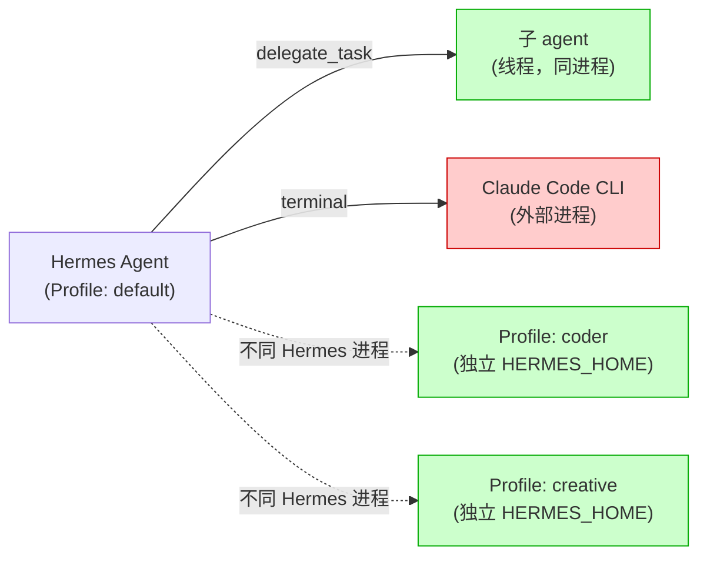
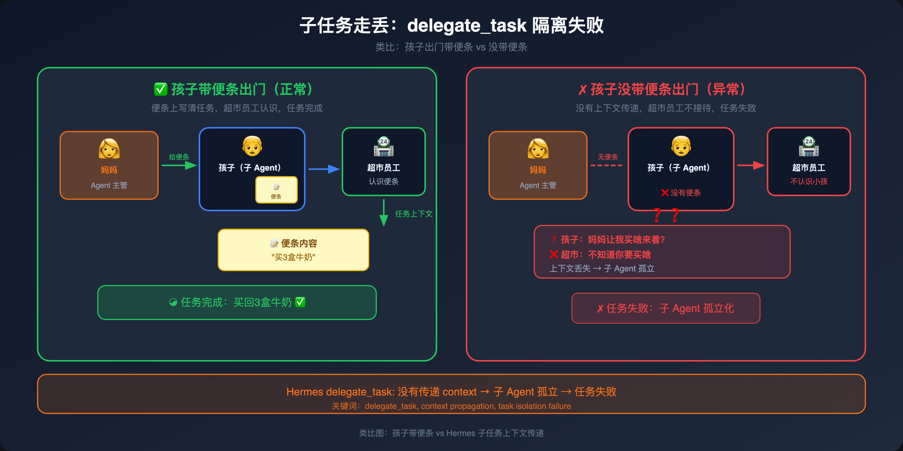
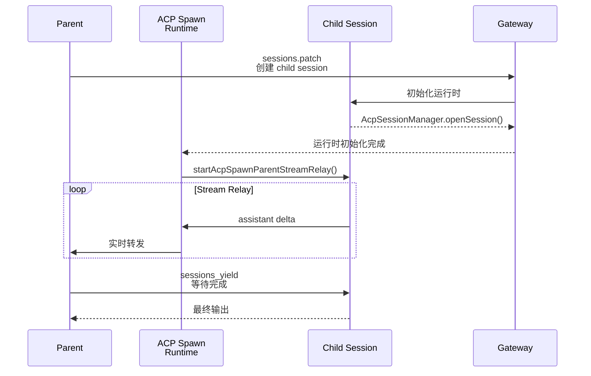
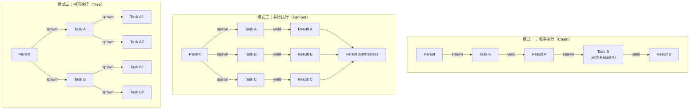

# 第三章：SubAgent 机制对比 — 外部工具调用 vs 真正的 Session 隔离委托

> 📌 **章节性质说明**
>
> 本章大量内容基于源码分析（OpenClaw ACP spawn 链、Hermes profile 机制、claude-code tool 实现），属于**原创分析**。
> 关于 Hermes profile 机制的澄清、以及 claude-code/codex 作为内置 tool 而非 skill 的区分，有官方源码参考。根因分析和坑位描述以原创为主。

---

## 3.1 Hermes Profile 机制的真实能力边界

很多人以为 Hermes "根本没有 SubAgent"，或者"Profile 就是多角色切换"——真相在两者之间。

**核心事实**：Profile 是**完全独立的 Hermes 实例**，不是角色切换机制。

### Profile 的实际含义

```bash
hermes -p coder chat
```

这一条命令背后发生的是：设置 `HERMES_HOME=~/.hermes/profiles/coder`，然后启动一个**全新的 hermes 进程**。

源码证据（`main.py:146`）：
```python
os.environ["HERMES_HOME"] = hermes_home  # profile 目录
# 随后启动新进程，加载该 HERMES_HOME 下的所有配置
```

wrapper 脚本更是直接（`profiles.py:241`）：
```sh
exec hermes -p {name} "$@"   # 每次都是 exec 新进程
```

profiles.py 的模块注释写得清清楚楚：

> Each profile is a **fully independent HERMES_HOME directory** with its own config.yaml, .env, memory, sessions, skills, **gateway**, cron, and logs.

每个 profile 有自己的 gateway 进程——这是进程隔离，不是配置切换。

### Profile 之间**无法通信**

这是最关键的误区：Profile A 和 Profile B 是两个完全隔离的进程，没有：
- 进程间通信机制
- 任务委托协议
- 结果汇总机制

你不能让 profile A 的 Agent 把任务交给 profile B 的 Agent，也没有"总管 profile 分发任务给 worker profile"这种设计。

**实用场景**：Profile 适合做**工作区隔离**——比如你有一个专门做代码的 profile（独立的记忆、独立的 skills、独立的 gateway），和一个专门做内容创作的 profile。两者完全独立，按需切换，不是协作。

### Hermes 的真实 SubAgent 机制

| 机制 | 形态 | 隔离性 |
|------|------|--------|
| **Profile** | 独立进程 + 独立 gateway | 完全隔离（进程级） |
| **claude-code tool** | 外部 CLI 进程 | 无 session 关联 |
| **delegate_task** | 同进程内子 session | 有隔离（parent_session_id） |

> 💡 【3句话版本】
> - Profile 是**完全独立的 Hermes 实例**（进程 + gateway），不是角色切换。
> - Profile 之间**没有通信机制**，不存在"团队协作"——你不能委托 profile A 的 Agent 去调用 profile B 的 Agent。
> - Hermes 真正的 SubAgent 机制是 `delegate_task`（同进程内 session 隔离）和 `claude-code tool`（外部 CLI，无隔离）。

---

## 3.2 Hermes 的 SubAgent：delegate_task vs 外部 CLI Skill

### 真正的 SubAgent 机制：delegate_task

Hermes 真正的 SubAgent 机制是 `delegate_task`（`tools/delegate_tool.py`），它**在同进程内启动独立的 AIAgent 子会话**，具有：

- **独立 session key**：`parent_session_id` 追踪父子关系
- **隔离上下文**：子 agent 从空白会话开始，不继承父 agent 的中间推理过程
- **受限 toolset**：`DELEGATE_BLOCKED_TOOLS` 排除 `delegate_task`（防递归）、`clarify`（防用户交互）、`memory`（防写共享记忆）等
- **同步阻塞**：父 agent 等待所有子 agent 完成（`ThreadPoolExecutor`）

```python
# delegate_tool.py 的核心隔离机制
DELEGATE_BLOCKED_TOOLS = frozenset([
    "delegate_task",   # 防递归
    "clarify",         # 防用户交互
    "memory",          # 防写共享记忆
    "send_message",    # 防跨平台副作用
    "execute_code",    # 强制步进推理
])
```

`MAX_DEPTH = 1`：默认只支持父 → 子一层的 flat 结构，grandchild 被拒绝（除非 `max_spawn_depth` 调高）。

### 另一种委托方式：claude-code / codex Skill

`claude-code` 和 `codex` 不是 Hermes 内置 tool——它们是**技能（SKILL）**，安装在 `~/.hermes/skills/autonomous-ai-agents/` 下，本质是调用外部 CLI 进程。

```
~/.hermes/skills/autonomous-ai-agents/
├── claude-code/SKILL.md   ← 技能（Skill），不是 tool
└── codex/SKILL.md          ← 技能（Skill），不是 tool
```

调用方式：通过 `terminal()` 工具执行 `claude -p '...'`（print 模式）或交互式 PTY 模式。源码证据（`claude-code/SKILL.md:37`）：

```bash
terminal(command="claude -p 'Add error handling to all API calls in src/' --allowedTools 'Read,Edit' --max-turns 10", workdir="/path/to/project", timeout=120)
```

**关键区别**：

| 维度 | `delegate_task` | `claude-code` Skill |
|------|----------------|---------------------|
| 隔离性 | ✅ 同进程子 session，`parent_session_id` 追踪 | ❌ 无 session 关联 |
| 调用方式 | ACP 协议，内部 spawn | `terminal()` 调用外部 CLI |
| 生命周期管理 | 父 agent 同步等待 | CLI 进程独立，Hermes 只等返回值 |
| 上下文继承 | 空白会话 | 无 |

### Hermes SubAgent 真实架构图



**真正的问题：`claude-code` Skill 调用外部 CLI 进程后，没有任何 session 关联、stream relay 或生命周期管理——过程对你完全黑盒。**

> 💡 【3句话版本】
> - Hermes 真正的 SubAgent 是 **`delegate_task`**——同进程内独立 session，`parent_session_id` 追踪，有隔离。
> - `claude-code` 和 `codex` 是**技能（SKILL）**，通过 `terminal()` 调用外部 CLI，**没有 session 关联**，任务跑到一半断了你不知道进度。
> - 解决办法是**用 `delegate_task`** 做真正的隔离委托，用 OpenClaw ACP `sessions_spawn` 做更完整的多 agent 协作。

---

## 3.3 Hermes Skills 目录结构

```bash
~/.hermes/skills/
├── hermes/                      # Hermes 官方/Bundled Skills
│   ├── skills-diagnosis/
│   ├── skills-judgment/
│   ├── hermes-approval-debugging/
│   └── ...（共10个官方 skill）
├── mcp/                          # MCP 协议集成
│   ├── mcporter/
│   └── native-mcp/
└── [user-created]/               # 用户创建的 Skills
    └── ...（数量因使用情况而异）
```

注意：`claude-code` 和 `codex` 也在 `~/.hermes/skills/autonomous-ai-agents/` 下，它们是**技能（SKILL）**，不是内置 tool。

---

## 3.4 Hermes 的 subtask 中断问题

### 什么是 subtask 中断？

"subtask 中断"指的是：当你在 Hermes 里通过 `claude-code` Skill 发起一个多步任务，如果任务执行到一半被打断（用户取消、消息超时、外部信号），任务的执行结果和状态会出现不一致。

**典型场景：**

1. 你让 Hermes 调用 `claude-code` Skill 执行一个代码重构任务
2. `claude` 正在跑 `git commit`，还没提交完
3. 用户发了新消息，或者飞书连接断了
4. Hermes 的 `terminal()` 返回了，但返回值可能是不完整的
5. 主 Agent 拿到不完整的返回值，继续执行，导致状态不一致

**注意**：`delegate_task` 有 session 隔离，中断时至少子 agent 的状态是完整的（由父 agent 的 `ThreadPoolExecutor` 管理）。真正的问题出在 `claude-code` Skill 这种无 session 关联的外部 CLI 调用。

### 根因：没有 Parent-Child Session 隔离

```mermaid
graph TD
    subgraph HermesSkill["Hermes claude-code Skill（无隔离）"]
        A1["Agent"] -->|terminal| B1["Claude Code CLI"]
        B1 -.->|无 session 关联| C1["独立进程<br/>状态丢失"]
    end

    subgraph HermesDelegate["Hermes delegate_task（有隔离）"]
        A2["Agent"] -->|delegate_task| B2["子 agent<br/>(线程，同进程)"]
        B2 -.->|parent_session_id| C2["独立 session<br/>生命周期受父管理"]
    end

    subgraph OpenClaw["OpenClaw ACP SubAgent（完整隔离）"]
        A3["Agent"] -->|ACP protocol| B3["SubAgent Session"]
        B3 -->|独立 session key| C3["完整状态<br/>生命周期管理"]
    end

    style A1 fill:#ffcccc
    style B1 fill:#ffcccc,stroke:#cc0000
    style C1 fill:#ffcccc
    style A2 fill:#ffcccc
    style B2 fill:#ccffcc,stroke:#00aa00
    style C2 fill:#ccffcc
    style A3 fill:#ccffcc
    style B3 fill:#ccffcc,stroke:#00aa00
    style C3 fill:#ccffcc
```



`delegate_task` 有 session 隔离，OpenClaw ACP 更完整。`claude-code` Skill 调用外部 CLI 完全无隔离。

### 📖 官方内容：on_delegation 钩子

> 以下来自 Hermes 源码注释（代表了设计意图，但非官方文档）：

```python
def on_delegation(self, task: str, result: str, *,
                  child_session_id: str = "", **kwargs) -> None:
    """Called on the PARENT agent when a subagent completes.

    This is a hook for observing subagent work — it gives the memory
    provider observation of what was delegated and what came back.
    The subagent's own memory is managed independently by that agent.
    """
    pass  # Default implementation does nothing
```

> 🧠 **原创分析：钩子 ≠ 协调机制**
>
> **设计意图：让 Memory Provider 知道"有 subagent 完成了工作"。**
>
> **实际情况：没有任何实际的协调逻辑。** 如果你想在 Hermes 里实现"等 subagent 做完这件事，再执行下一个任务"，你得自己写这个逻辑，Hermes 没有提供。这个钩子只是一个"观察哨"，不是协调器。

> 💡 【3句话版本】
> - 它就像**在门口装了个摄像头，说"孩子回来了我会看到"**——`on_delegation` 钩子只是通知你"任务完成了"，但不会帮你做任何协调或等待。
> - 但问题是**钩子不会帮你排队**——如果你的主任务依赖子任务的结果，Hermes 不会等你，父 Agent 会直接继续往下走。
> - 解决办法是**自己实现等待逻辑**（如轮询子任务状态），或在 OpenClaw 里用 `sessions_yield` 显式等待。

---

## 3.5 🎯 类比：Hermes SubTask 就像让孩子独自去超市买东西



想象你让孩子去超市买牛奶：

**OpenClaw ACP sessions_spawn 的方式：**
- 你给孩子一张纸条（session key）
- 超市员工（SubAgent）按纸条记录孩子买了什么
- 你在家里实时收到孩子买牛奶的进度（stream relay）
- 买完了你回家验收（sessions_yield）

**Hermes claude-code Skill 的方式：**
- 你把孩子往超市门口一放（terminal() 调用外部 CLI）
- 你不知道孩子走到哪儿了（无 stream relay）
- 孩子买没买到、买了什么，你只能等他回来说（返回值可能不完整）
- 如果孩子中途被截走（中断），你就不知道结果了

**`delegate_task` 有 session 隔离，算是"拴着绳子"；`claude-code` Skill 才是真正的"放养模式"。**

---

## 3.6 OpenClaw 的 sessions_spawn + ACP 实际表现

### 完整的 spawn 链



### Session Key 格式完全隔离 parent 和 child

```
parent session:  agent:main:session:${uuid}
child session:  agent:${targetAgentId}:acp:${uuid}
```

### 流式转发（Stream Relay）机制

`startAcpSpawnParentStreamRelay()` 负责把 child 的 assistant delta 实时转发回 parent session。

**工作方式：**
1. Child 每次有 assistant 输出（delta），发送给 relay
2. Relay 把 delta 写入 `.acp-stream.jsonl`（持久化）
3. 同时把 delta 转发给 parent session
4. Parent 的 UI 可以实时看到 child 的执行过程

**这比 Hermes 的 tool_call 模式体验好很多**——你能看到子 Agent 正在做什么，而不是等它全部完成才能看到结果。

---

## 3.7 OpenClaw 的坑：Child 超时不自杀

### 📖 官方内容：ACP 超时配置

> 以下来自 OpenClaw 官方文档对超时配置的描述：

```
ACP SubAgent 超时配置：
- noOutputNoticeMs: 无输出多久后发通知
- maxRelayLifetimeMs: 最大 relay 生命周期
- Child 进程在超时时会被监控，但不保证强制 kill
```

> 🧠 **原创分析：监控 ≠ kill**
>
> 官方写了"监控"，但没写"kill"。实际上**有监控无 kill**。Child 进入死循环或长时间无输出，Parent 只能等到 gateway 重启，Child 变成孤儿进程继续占用资源。

> 💡 【3句话版本】
> - 它就像**物业说"我们会监控违停"但不会拖车**——OpenClaw ACP 监控了 Child 超时，但不会主动 kill 它，任由它变成孤儿进程继续占用资源。
> - 但问题是**孤儿进程不会自己消失**，会一直占用 CPU 和内存，直到 gateway 重启才会清理。
> - 解决办法是**写一个 cron 脚本定期 `kill` 孤儿进程**，或者给 spawn 的任务加超时强制 kill，而不是依赖 ACP 自己的监控。

### 坑位速查

| 坑 | 描述 | 影响 |
|----|------|------|
| **Child 超时不自杀** | noOutputNoticeMs/maxRelayLifetimeMs 有监控但无强制 kill | 孤儿进程占用资源 |
| **Stream relay 数据丢失** | relayBuffer 在内存中，没写盘就崩溃就丢了 | 重要任务的中间结果丢失 |
| **飞书并发 Spawn 冲突** | <100ms 内两次 spawn 共享 thread_id | 流混在一起 |
| **spawn 后没有 yield** | Agent 调用 sessions_spawn 但不调用 sessions_yield | 不知道任务结果 |
| **ACP 桥接 Claude Code** | 格式不兼容，多模态 content 丢失 | 复杂任务不可用 |

### 定期清理 sessions 的建议

OpenClaw 的 sessions 文件（包括 dreaming sessions、.acp-stream.jsonl 等）不会自动清理，长期运行后会占用大量磁盘空间。**建议给 OpenClaw 创建定时任务，每天自动清理过期 sessions：**

```bash
# 定期清理 OpenClaw sessions（每天一次）
# 清理超过 12 小时无活跃的 dreaming session 和孤儿 stream 文件

# 1. 清理 dreaming sessions（12小时无活跃）
find ~/.openclaw/sessions/ -name "*dreaming*" -mmin +720 -delete

# 2. 清理孤儿 .acp-stream.jsonl 文件（对应 session 已不存在）
# 需要写脚本对比 sessions 目录和 stream 文件的 session key

# 3. 清理过大的 session transcript 文件（> 1MB 的 .jsonl）
find ~/.openclaw/sessions/ -name "*.jsonl" -size +1M -mmin +720 -delete

# 4. 重启 gateway 使清理生效
openclaw gateway restart
```

> 📌 **建议发给 OpenClaw**：让 OpenClaw 创建一个定时任务（cron job），每天自动执行上述清理脚本，并在 AGENTS.md 或 TOOLS.md 里记录清理频率和保留策略。

---

## 3.8 任务编排模式图解



---

## 3.9 小结

| 维度 | Hermes Profile + claude-code | OpenClaw sessions_spawn + ACP |
|------|------------------------------|-------------------------------|
| **真实存在** | ✅ Profile 机制 + claude-code Skill | ✅ 原生 ACP session spawn |
| **多角色隔离** | ✅ Profile 独立进程 | ✅ 独立 session key |
| **Parent-Child 隔离** | ⚠️ claude-code Skill 无隔离；delegate_task 有隔离（parent_session_id 追踪） | ✅ 独立 session key |
| **流式转发** | ❌ 无 | ✅ stream relay |
| **Session 管理** | ⚠️ delegate_task 有 | ✅ AcpSessionManager |
| **生命周期管理** | ⚠️ delegate_task 有但不完善 | ⚠️ 有但不完善（超时不自杀） |
| **外部 CLI 桥接** | ✅ claude-code/codex Skill | ❌ 格式不兼容（acpx） |
| **使用门槛** | 低（Skill 调用） | 高（需要理解 ACP 协议） |

**核心结论：OpenClaw 的 ACP SubAgent 机制在架构上远比 Hermes 完整（独立 session、流式转发、生命周期管理），但执行层有几个坑（超时不自杀、Stream relay 数据丢失、并发 Spawn 问题）。生产环境用 SubAgent 时，必须有超时机制和结果验证，不能裸依赖 ACP 的默认行为。Hermes 的 `delegate_task` 提供了真正的 session 隔离，是比 `claude-code` Skill 更可靠的委托方式，但缺乏流式转发。Profile 适合做工作区隔离，不是多 Agent 协作。**

---

## 📦 SKILL：第三章实战精华

- [Hermes 实战指南（All-in-One）](Hermes配置与优化.md)
- [OpenClaw 实战指南（All-in-One）](OpenClaw配置与优化.md)