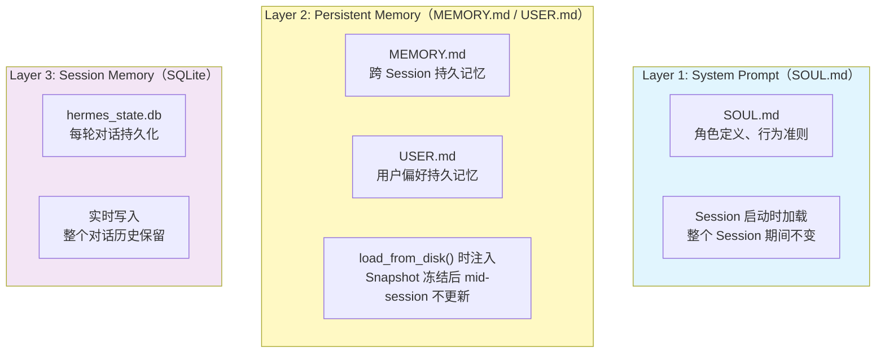
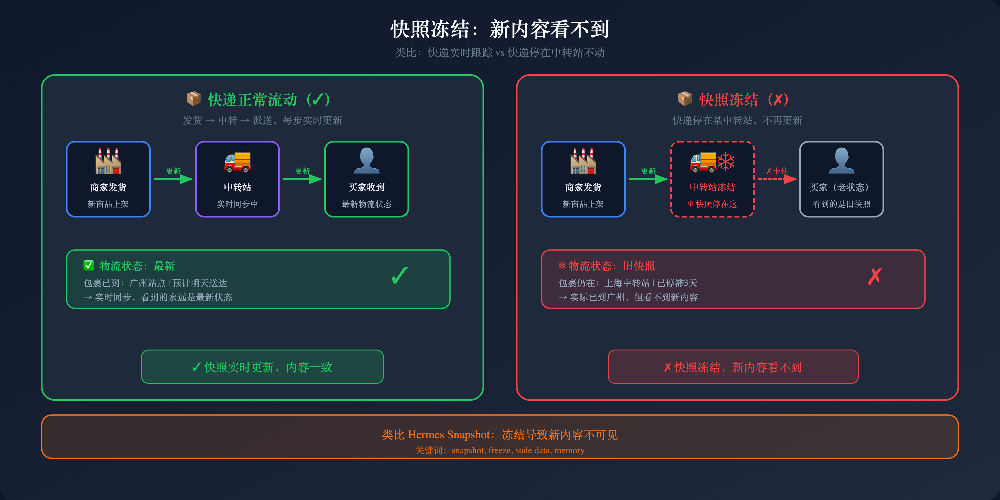
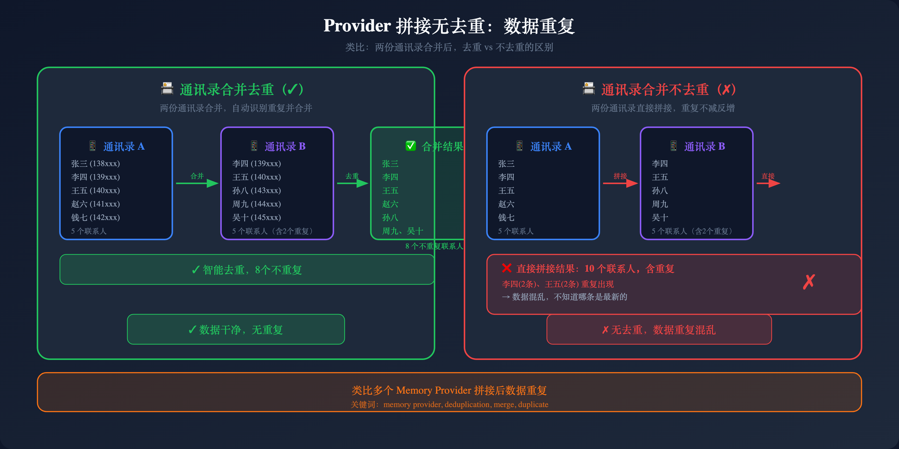
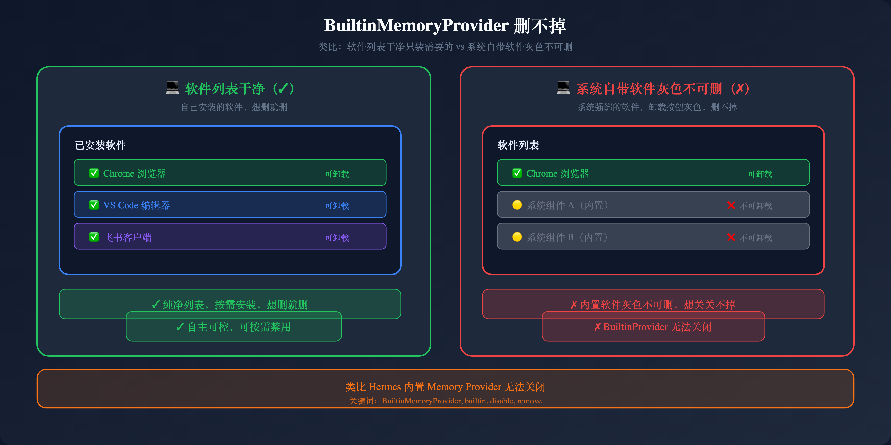
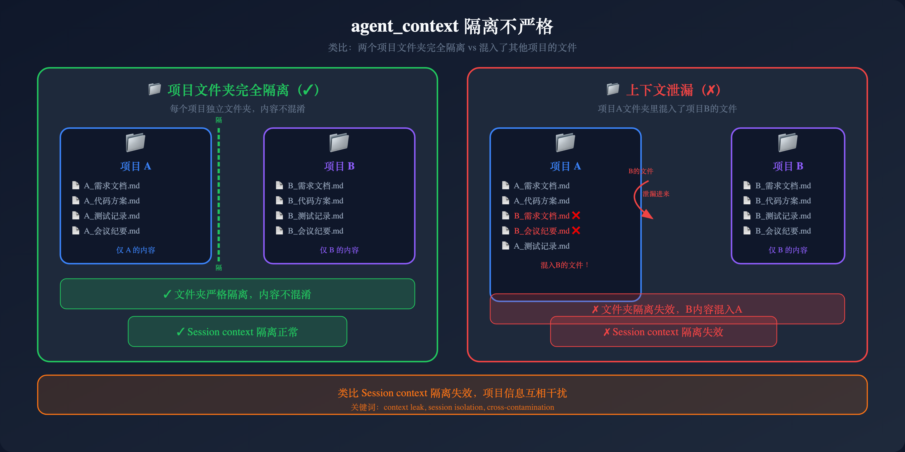
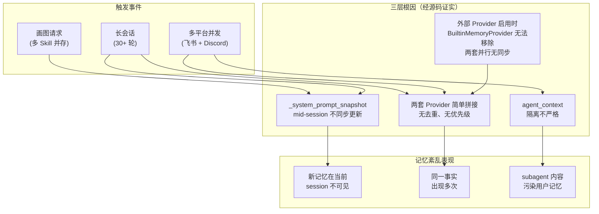
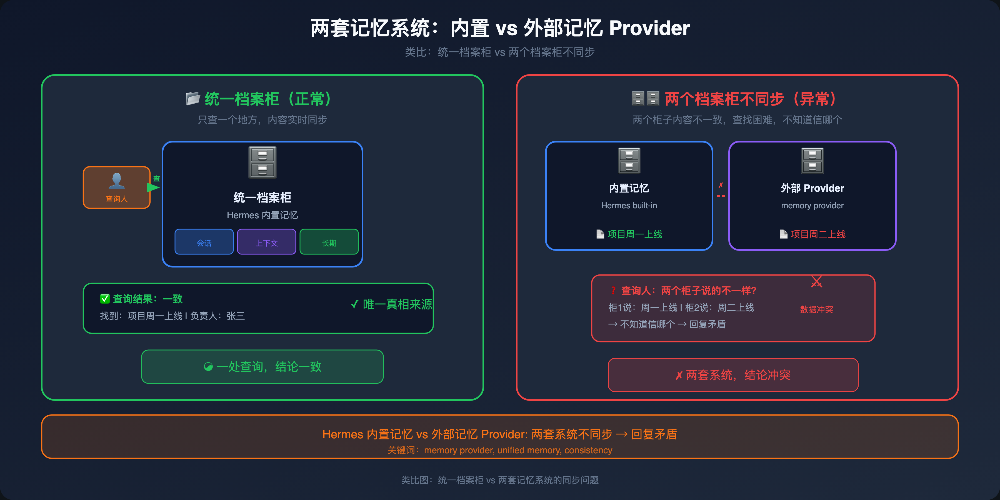
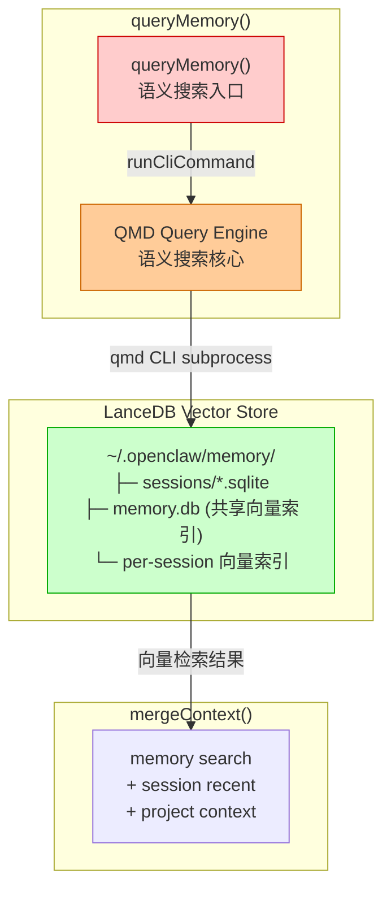
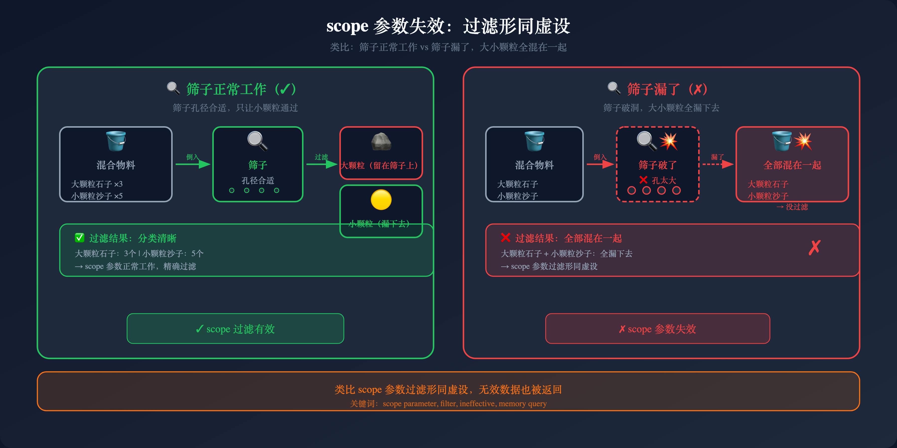
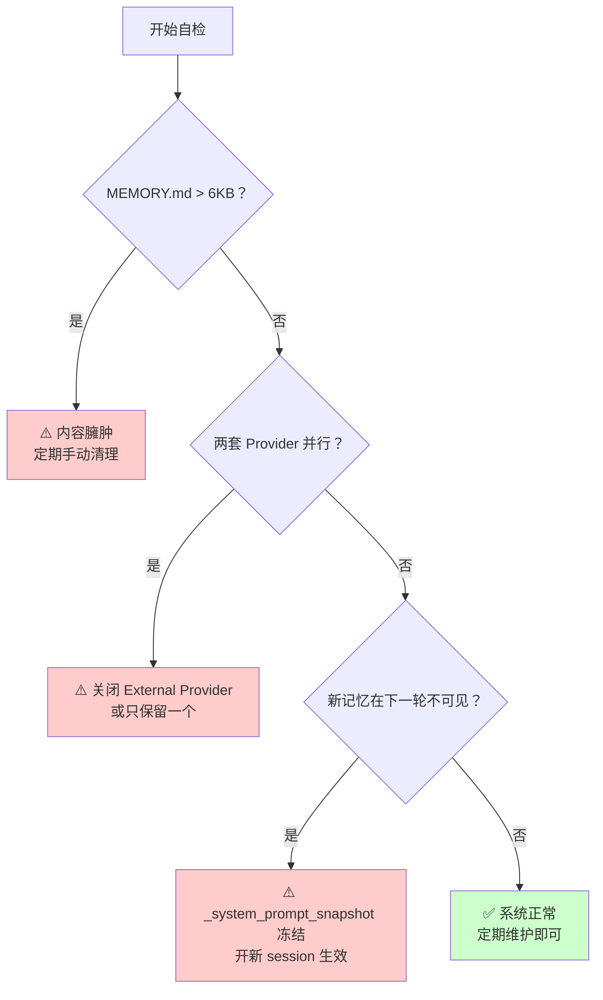

# 第四章：Memory 系统对比 — 三层记忆架构与 Provider 拼接问题

> 📌 **章节性质说明**
>
> 本章核心内容基于 Hermes **源码验证**，包含原创分析。
> 所有关于 Hermes 的说法均来自 `memory_manager.py`、`memory_tool.py` 等源码文件。
> 部分描述标注「存疑/待核实」表示缺乏源码印证的说法。

---

## 4.1 理解 Hermes 的 Memory 问题

很多人以为 Hermes 的记忆紊乱是"skill 记忆出了问题"。

**真正的问题根源是：三层记忆架构 + Provider 简单拼接无去重。**

---

## 4.2 Hermes 三层记忆架构 — 理解记忆的关键


Hermes 的记忆由三层构成，每层有明确的职责：



### 各层加载时机与行为

| 层次 | 内容 | 加载时机 | Mid-session 写入是否同步 |
|------|------|---------|----------------------|
| **Layer 1** | SOUL.md（System Prompt） | Session 启动时全新加载 | 不适用（全新） |
| **Layer 2** | MEMORY.md / USER.md 快照 | `load_from_disk()` 时捕获 snapshot | **否**（frozen snapshot） |
| **Layer 3** | hermes_state.db（SQLite） | 实时累积每轮对话 | 是（实时持久化） |

### 源码证据

**① `_system_prompt_snapshot` 在 session 启动后 frozen（`memory_tool.py:110-122`）**

```python
# tools/memory_tool.py:110-122
class MemoryStore:
    """
    Maintains two parallel states:
      - _system_prompt_snapshot: frozen at load time, used for system prompt injection.
        Never mutated mid-session. Keeps prefix cache stable.
      - memory_entries / user_entries: live state, mutated by tool calls, persisted to disk.
    """
    def __init__(self, ...):
        # Frozen snapshot for system prompt -- set once at load_from_disk()
        self._system_prompt_snapshot: Dict[str, str] = {"memory": "", "user": ""}
```

**② `load_from_disk()` 时捕获快照（`memory_tool.py:125-137`）**

```python
# tools/memory_tool.py:125-137
def load_from_disk(self):
    """Load entries from MEMORY.md and USER.md, capture system prompt snapshot."""
    self.memory_entries = self._read_file(mem_dir / "MEMORY.md")
    self.user_entries = self._read_file(mem_dir / "USER.md")
    # Deduplicate entries (preserves order, keeps first occurrence)
    self.memory_entries = list(dict.fromkeys(self.memory_entries))
    self.user_entries = list(dict.fromkeys(self.user_entries))
    # Capture frozen snapshot for system prompt injection
    self._system_prompt_snapshot = {
        "memory": self._render_block("memory", self.memory_entries),
        "user": self._render_block("user", self.user_entries),
    }
```

**③ `add()` 等写入操作不更新 snapshot（`memory_tool.py:221-263`）**

```python
# tools/memory_tool.py:221 (add method summary)
def add(self, target: str, content: str) -> Dict[str, Any]:
    # ... validation ...
    entries.append(content)
    self._set_entries(target, entries)
    self.save_to_disk(target)
    # NOTE: _system_prompt_snapshot is NOT updated here
    return self._success_response(target, "Entry added.")
```

**`format_for_system_prompt()` 注释明确说明快照不同步（`memory_tool.py:361-369`）**

```python
# tools/memory_tool.py:361-369
def format_for_system_prompt(self, target: str) -> Optional[str]:
    """
    Return the frozen snapshot for system prompt injection.

    This returns the state captured at load_from_disk() time, NOT the live
    state. Mid-session writes do not affect this. This keeps the system
    prompt stable across all turns, preserving the prefix cache.
    """
    block = self._system_prompt_snapshot.get(target, "")
    return block if block else None
```

---

## 4.3 记忆紊乱的真正根因：三层架构 + Provider 简单拼接

### 根因一：_system_prompt_snapshot 在 session 启动后 frozen

由于 `_system_prompt_snapshot` 只在 `load_from_disk()` 时捕获，之后的 mid-session 写入（`add()`、`replace()`、`remove()`）只更新 `memory_entries`/`user_entries` 和磁盘文件，但**不会更新 snapshot**。

这意味着：
- 你在 session A 中对 MEMORY.md 做了写入
- session A 的后续 turn 看不到新写入的内容（因为用的是 frozen snapshot）
- 只有 session B 启动时，snapshot 才会刷新

**这就是为什么"新建的记忆在下一个问题里没有被记住"。**

> 💡 【3句话版本】
> - 它就像**把当天的日记锁进保险箱，但明天才能打开**——你今天写入的内容（`add()`）被存到了磁盘，但 `_system_prompt_snapshot` 在 session 启动时就冻结了，不会同步更新。
> - 但问题是**下一个问题来的时候，用的还是昨天（上个 session）打开的那本日记**——新内容根本不在上下文里，Agent 只能靠猜。
> - 解决办法是**每次改完 MEMORY.md 开一个新 session**，或者把真正重要的信息直接写进 SOUL.md（不走 memory 系统）。



### 根因二：Provider 简单拼接无去重，最多三层内容并行（`memory_manager.py:157-174`）

`build_system_prompt()` 把所有 provider 的 `system_prompt_block()` 结果简单追加：

```python
# agent/memory_manager.py - build_system_prompt() 方法
def build_system_prompt(self) -> str:
    blocks = []
    for provider in self._providers:
        try:
            block = provider.system_prompt_block()
            if block and block.strip():
                blocks.append(block)  # 简单追加，无去重
        except Exception as e:
            logger.warning(...)
    return "\n\n".join(blocks)
```

如果两个 provider 都写了同一个事实（BuiltinMemoryProvider 说"不加糖"，Honcho 也说"不加糖"），两者都注入，不会去重。Agent 以哪个为准是未定义行为。

> 💡 【3句话版本】
> - 它就像**两个秘书各记各的，你问她们同一个问题，答案可能不一样**——BuiltinMemoryProvider 和 ExternalProvider 各自独立写入，拼接时无优先级、无去重。
> - 但问题是**两套系统里同一个事实可能打架**，Provider A 说"不加糖"，Provider B 说"加糖"，Agent 不知道该信谁。
> - 解决办法是**只留一个 Provider**（把 External Provider 关掉），或明确告诉 Agent 以哪个 Provider 的内容为准。



### 根因三：外部 Provider 启用时，BuiltinMemoryProvider 无法移除

`BuiltinMemoryProvider`（MEMORY.md / USER.md）是内置的默认 provider，配了外部 Provider 后，两套并行，没有同步机制：

```python
# agent/memory_manager.py:7
"The BuiltinMemoryProvider is always registered first and cannot be removed."
```

如果同时启用了 Honcho 或 Mem0，会变成：BuiltinMemoryProvider 写一份，外部 Provider 写一份，拼接时无优先级、无去重。

**不用外部 Provider 的人不受影响——单 provider 没有这个问题。**



### 根因四：agent_context 隔离不严格

```python
# agent/memory_provider.py - initialize() 注释
"""
Providers should skip writes for non-primary contexts (cron system
prompts would corrupt user representations).
"""
```

「应」不是「必须」。如果某个 Provider 实现有 bug，或者外部 Provider 根本没判断 `agent_context`，就会把 subagent 或 cron 的信息写进用户记忆。

> 💡 【3句话版本】
> - 它就像**清洁工进了你的私人书房扫地**——subagent 或 cron 的信息本不该写入用户记忆，但如果 Provider 实现有 bug，就会"顺手"写进去。
> - 但问题是**你不知道什么时候被"顺手"了**——隔离是"应"做的，不是"必须"做的，取决于每个 Provider 的实现质量。
> - 解决办法是**在 External Provider 实现里严格判断 `agent_context`**，只允许 primary context 写入用户记忆。



---

## 4.4 记忆紊乱完整因果链



---

## 4.5 🎯 类比：记忆紊乱就像两个秘书各记各的

想象你有两个秘书：

- **秘书 A** 把你说的话记在笔记本上（BuiltinMemoryProvider）
- **秘书 B** 在脑子里记（External Provider）

你跟第一个秘书说"我咖啡不加糖"，他记在本子上。

但第二个秘书不知道，因为她不是从本子上读的，是自己听你说的。

下次你问"我咖啡怎么喝的？"
- 秘书 A 说："不加糖"
- 秘书 B 说："呃……加糖吧？"

**两套系统各管各的，没有同步。** 这就是 Hermes BuiltinMemoryProvider 和 ExternalProvider 的关系。



---

## 4.6 OpenClaw 的 QMD + LanceDB 方案

### 📖 官方内容：OpenClaw Memory 架构

> 以下来自 OpenClaw 官方文档对 Memory 架构的描述：

```
OpenClaw 记忆系统设计原则：
1. queryMemory() 通过 qmd CLI subprocess 与 LanceDB 交互
2. LanceDB 在 ~/.openclaw/memory/ 存储向量索引
3. 每个 session 有独立的 .sqlite 文件和 .jsonl transcript
4. mergeContext() 聚合 memory search + session recent + project context
```

### OpenClaw Memory 完整架构

OpenClaw 的 Memory 系统由三个核心组件构成：



**核心组件说明：**

| 组件 | 职责 | 说明 |
|------|------|------|
| **queryMemory()** | 语义搜索入口 | AI 调用此工具发起记忆查询 |
| **QMD Query Engine** | 语义搜索核心 | 解析 query，执行向量相似度搜索 |
| **LanceDB Vector Store** | 向量存储层 | per-session 级别的向量索引，存储在 `.sqlite` 文件中 |
| **mergeContext()** | 上下文聚合 | 将 memory search + session recent + project context 合并 |

**查询流程：**

```
queryMemory("我上次调研了什么？")
    ↓
runCliCommand → qmd CLI subprocess
    ↓
QMD Query Engine 解析 query
    ↓
LanceDB Vector Store 执行向量相似度搜索
    ↓
返回最相关的记忆片段
    ↓
mergeContext() 与 session recent / project context 聚合
```

**设计理念：显式优于隐式**

OpenClaw 的 Memory 设计遵循"显式优于隐式"原则：
- 所有记忆都通过 `add()` 显式写入
- 查询结果明确标注来源（session / user / workspace）
- 不依赖隐式的上下文推断

> 🧠 **原创分析：架构优点与工程坑点**
>
> **优点：** 文件级隔离比 Hermes 的表级隔离更干净，不同 session 的向量不会混在一起。QMD 提供语义搜索能力，比 Hermes 的 FTS5 关键词搜索更精准。
>
> **坑点：** CLI subprocess 有冷启动延迟，llama.cpp 模型加载慢，memory.db 并发写入有 lock timeout。

---

## 4.7 Hermes vs OpenClaw Memory 全面对比

| 维度 | Hermes | OpenClaw | 实战建议 |
|------|--------|----------|---------|
| **向量搜索** | ❌ FTS5 关键词 | ✅ LanceDB 语义 | OpenClaw 赢 |
| **查询延迟** | 低（SQLite 直连） | 高（CLI subprocess + 模型加载） | Hermes 赢 |
| **Session 隔离** | 表级（同一 db） | 文件级（完全隔离） | OpenClaw 赢 |
| **多 Provider** | ✅ 支持 Honcho/Mem0 | ❌ 无 | Hermes 场景多时赢 |
| **并发写入稳定性** | 成熟（hermes_state.db） | ⚠️ lock timeout 风险 | Hermes 赢 |
| **冷启动** | 快 | 慢（llama.cpp 加载） | Hermes 赢 |
| **数据一致性** | ⚠️ 两套 Provider 并行无同步 | ✅ 单一系统 | OpenClaw 赢 |

> **"Hermes 找到的东西可能不够精准，但一定找得到。OpenClaw 找到的相关内容更准，但找的过程更慢、更不稳定、可能丢结果。"** — 月明

---

## 4.8 OpenClaw Memory 三大坑

### 📖 官方内容：QMD scope 参数

> 以下来自 OpenClaw 官方文档对 scope 参数的描述：

```
queryMemory() 的 scope 参数用于限制查询范围：
- session: 只查当前 session
- user: 查用户级记忆
- workspace: 查工作区级记忆
```

> 🧠 **原创分析：scope 过滤经常失效**
>
> 源码中 scope 只是传给 qmd CLI，**如果 qmd 版本不对或参数解析出错，scope 过滤失效，全局搜索**。后果是：在 session A 中做的项目决策， session B 查询时可能拿到 session A 的敏感内容。Session 隔离只做到了**存储层**，没做到**查询层**。

> 💡 【3句话版本】
> - 它就像**图书馆说"这本只能在本馆阅读"，但门禁系统坏了，谁都能进**——`scope` 参数设计上是隔离机制，但参数解析出错时直接失效，变相全局搜索。
> - 但问题是**session A 的项目决策可能泄露到 session B**，隐私和隔离都成了空话。
> - 解决办法是**定期查 scope 参数是否生效**（用不同 session 测试），同时不要在 memory 里存真正敏感的隐私内容。



### 坑位速查


| 坑 | 描述 | 影响 |
|----|------|------|
| **QMD CLI 冷启动延迟** | 每次 queryMemory() 都要 spawn 子进程，200-500ms | 飞书消息回复延迟 |
| **llama.cpp 模型加载慢** | 第一次 embedding 加载 500MB-1GB，3-8 秒 | 冷启动时 memory 查询失败 |
| **memory.db 并发写入 lock** | WAL 机制保证不丢数据，但可能 lock timeout | 高并发写入时 memory 查询失败 |
| **QMD scope 参数过滤失效** | 参数解析出错时默默忽略，全局搜索 | 跨 session 隐私泄露 |
| **.jsonl 文件 append-only 不去重** | 重试时 append 重复 entry | semantic search 结果偏差 |
| **Dreaming session 幽灵残留** | gateway 重启后不恢复，占用空间 | 磁盘空间浪费 |

> 💡 【3句话版本】
> - 冷启动延迟就像**每次查资料都要重新烧开水**——QMD CLI 每次都要 spawn 子进程，llama.cpp 每次都要加载模型，3-8 秒的等待是真实代价。
> - 并发写入 lock 就像**停车场入口闸机坏了**——WAL 机制本身没问题，但高并发时 lock timeout 导致 memory 查询直接失败。
> - 解决办法是**gateway 启动后做一次 warmup query**（预热模型），高并发场景下降低 memory 写入频率，或给 `memory.db` 设置更长的 timeout。

---

## 4.9 Hermes 记忆紊乱自检方法

### 三步自检流程

**Step 1：检查 MEMORY.md 是否臃肿**

```bash
# 查看 MEMORY.md 大小
wc -c ~/.hermes/memories/MEMORY.md
# 正常 < 6KB，超过说明内容过多需要清理
```

**Step 2：检查是否有多 Provider 并行**

```bash
# 查看是否配置了 External Provider
grep -r "honcho\|mem0\|hindsight\|external" \
  ~/.hermes/config.yaml 2>/dev/null

# 如果有输出，说明存在两套 Provider 并行
```

**Step 3：验证 mid-session 写入是否生效**

```bash
# 在 Hermes 中执行：
# "在 MEMORY.md 里加一条：咖啡不加糖"
# 然后立刻问："我咖啡怎么喝的？"
# 如果回答不知道，说明 _system_prompt_snapshot 未更新
```

### 判断树



---

## 4.10 实战建议：怎么用好两套 Memory 系统

### Hermes Memory 最佳实践

**① 开新 session 使新记忆生效**
mid-session 写入的 memory 要等下次 session 启动才能看到。

**② 定期手动维护 MEMORY.md**

**③ 控制 External Provider 的数量（只留一个，或关闭）**

```yaml
# ~/.hermes/config.yaml
memory:
  provider: null  # 关闭外部记忆服务，只用内置
```

**④ 控制单 session 轮数（< 30 轮）**

**⑤ 在 SOUL.md 里写死高频事实**

### OpenClaw Memory 最佳实践

**① 预热 embedding 模型**（gateway 启动后做一次 dummy query）

**② 关闭不需要的 memory 功能**

**③ 为高频查询创建"热点记忆"**（直接写在 AGENTS.md 里）

**④ 定期清理幽灵 session**（find ... -name "*dreaming*"）

**⑤ 高并发场景下降低 memory 写入频率**

---

## 4.11 小结

| 问题 | Hermes 根因（源码证实） | OpenClaw 根因 |
|------|----------------------|--------------|
| **新记忆在当前 session 不可见** | `_system_prompt_snapshot` mid-session frozen | QMD CLI 冷启动慢 |
| **同一事实出现多次** | 两套 Provider 简单拼接无去重 | N/A |
| **只能注册一个外部 Provider** | `memory_manager.py:163-174` 设计约束 | N/A |
| **BuiltinMemoryProvider 无法移除** | 源码设计，始终第一个注册 | N/A |
| **多 session 记忆污染** | Provider 拼接无优先级 | scope 参数过滤失效 |
| **并发写入失败** | External Provider 并发问题 | memory.db lock timeout |
| **幽灵 session** | N/A | gateway 重启后 dreaming session 不恢复 |
| **记忆不精准** | FTS5 只能关键词匹配 | LanceDB 语义但依赖模型质量 |

**核心结论：Hermes 的记忆问题是三层上下文结构（snapshot frozen + Provider 简单拼接无去重）的架构性问题。OpenClaw 的记忆问题更多是工程性的（冷启动延迟、并发写入）。如果你对记忆准确性要求高（语义搜索），选 OpenClaw；如果你对可靠性要求高（不丢记忆、快速响应），选 Hermes。**

---

## 📦 SKILL：第四章实战精华

- [Hermes 实战指南（All-in-One）](Hermes配置与优化.md)
- [OpenClaw 实战指南（All-in-One）](OpenClaw配置与优化.md)
