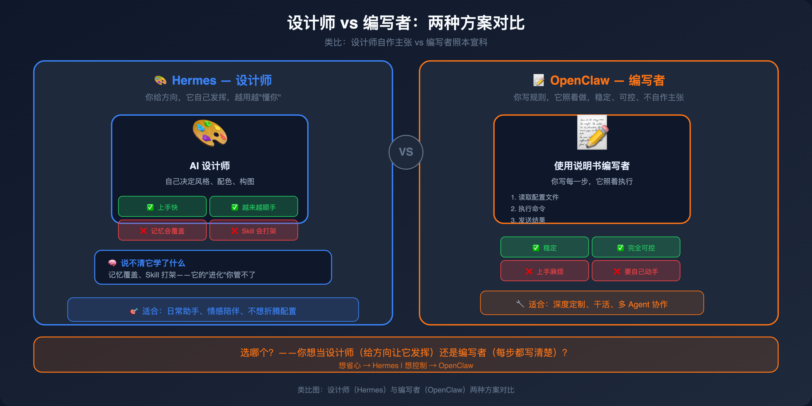

# 第五章：选型建议与避坑指南 — 实战者的决策手册

---

## 5.1 一句话选哪个

**你想让 Agent 帮你干活，还是只是想有个省心的助手？**

```
想省心 → Hermes（注意几个坑，定期维护）
想深度定制、让 Agent 真正帮你干活 → OpenClaw
```

---

## 5.2 两种选择的核心区别


|          | Hermes           | OpenClaw       |
| -------- | ---------------- | -------------- |
| **核心理念** | Agent 自己决定，你来维护 | 你写规则，Agent 执行 |
| **上手难度** | 低，装上就开始"懂你"     | 高，要自己配置        |
| **维护成本** | 中等，要定期清理 Skills  | 前期投入大，后期稳    |
| **稳定性**  | 偶尔"失忆"          | 比较稳定           |
| **定制化**  | 有限，Agent 自己判断    | 很高，你说了算        |

**简单说：**

- Hermes 像**设计师**——你给方向，它自己发挥。越用它越"懂你"，但你越来越说不清它到底学了什么。
- OpenClaw 像**编写使用说明书**——每一步都要写清楚，它照着做。上手麻烦，但用好了很听话。

---

## 5.3 什么时候选 Hermes？

### 适合用 Hermes 的场景

**场景一：想省心，不想花时间配置**

Hermes 用几次就开始"懂你"了。自动创建 Skill 功能会让它越来越顺手。

**前提：你要愿意定期维护（清理 Skill、注意那几个坑）。**

**场景二：多平台消息聚合**

Slack、Discord、Telegram 都要接？Hermes 支持 18 个平台【建议值，无公开依据】，一个 Agent 全搞定。

**场景三：不想折腾，直接上手用**

不需要配置什么，接入飞书就能用。适合不想花时间折腾的人。

---

## 5.4 什么时候选 OpenClaw？

### 适合用 OpenClaw 的场景

**场景一：想让 Agent 真正帮你干活**

Hermes 帮你处理日常问答可以，但让它独立完成项目？差点意思。OpenClaw 的 subagent 机制更完整。

**场景二：飞书多账号 Bot 系统**

需要同时跑多个 Bot，每个 Bot 有独立角色？OpenClaw 的多 Bot 配置更成熟。

**场景三：深度定制，不接受"差不多"**

Hermes 会自己判断怎么做，但你有时候想要它按你的方式做。OpenClaw 你说了算。

**场景四：不想踩 Hermes 的那些坑**

记忆紊乱、Skill 打架这些问题在 OpenClaw 里基本不存在。

---

## 5.5 类比：Hermes 是设计师，OpenClaw 是编写者

**Hermes 像设计师：**
- 你告诉它"帮我做一批配图"
- 它自己决定风格、配色、构图
- 做着做着它会"自己学"，下次越来越顺手
- 但你越来越说不清它到底学了什么——记忆会覆盖、Skill 会打架

**OpenClaw 像编写使用说明书：**
- 你告诉它"先读这个文件、再执行那个命令、最后发给我"
- 每一步都要写清楚，它照着做
- 稳定，不会自作主张
- 但想加新功能得自己动手写



## 5.6 避坑速查表


### Skills 避坑

| 坑 | Hermes | OpenClaw |
|----|--------|----------|
| Skill 泛滥 | ✅ 定期清理 | ✅ 基本不会 |
| Skill 冲突 | ❌ 只检名字 | ⚠️ 无检语义 |
| Skill 不生效 | ⚠️ snapshot（会话快照，存储当前对话上下文）不同步 | ✅ 下次回复前刷新 |
| Skill 选错 | ⚠️ 随机性 | ⚠️ description 歧义 |

> 💡 【3句话版本】
> - Skill 泛滥就像**抽屉塞满了但不知道哪件衣服最适合今天穿**——Hermes 自动创建后 Skill 越积越多，OpenClaw 靠手动安装所以基本不会。
> - Skill 冲突和选错就像**同一个问题问了四个同事，答案都不一样**——Hermes 只检名字不检语义，OpenClaw 靠 description 模糊匹配。
> - 解决办法是**给每个 Skill 写清晰的 description，避免关键词重叠；定期 review，合并重复的 Skill**。

### SubAgent 避坑

| 坑 | Hermes | OpenClaw |
|----|--------|----------|
| 子任务中断 | ⚠️ claude-code 无隔离；delegate_task 有隔离 | ✅ 独立 session |
| 结果收集 | ⚠️ 返回值可能不完整 | ⚠️ 要调用 sessions_yield |
| 超时不停止 | ⚠️ 外部 CLI 需手动 kill | ⚠️ 无强制 kill |
| 外部 CLI 桥接 | ✅ claude-code skill | ❌ acpx 格式不兼容 |

> 💡 【3句话版本】
> - Hermes 的 `claude-code` 是内置 tool 直接调用外部 CLI，**但没有 session 隔离和流式转发**——任务跑到一半断了，结果可能不完整。
> - OpenClaw ACP 有独立 session 和 stream relay，**但超时不自杀、spawn 后不 yield 就白跑**——有架构优势但坑也多。
> - 解决办法是**OpenClaw spawn 后一定要调用 `sessions_yield`；给任务加超时强制 kill 机制**。

### Memory 避坑

| 坑 | Hermes | OpenClaw |
|----|--------|----------|
| 记忆看不到新内容 | ✅ frozen snapshot | ⚠️ CLI 冷启动慢 |
| 多 session 污染 | ⚠️ Provider 并行 | ⚠️ scope（上下文范围过滤）参数可能失效 |
| 并发写入失败 | ⚠️ External Provider | ⚠️ memory.db lock |
| 幽灵 session | ⚠️ Background Review 叠加 | ⚠️ dreaming（后台探索会话）session |

> 💡 【3句话版本】
> - Hermes 的记忆问题是**三层架构性的**（snapshot 冻结 + Provider 并行无去重），OpenClaw 是**工程性的**（冷启动慢、并发 lock）。
> - Hermes "记忆不到新内容"是 frozen snapshot 导致的，OpenClaw 是 QMD CLI 冷启动导致的——**原因不同，应对方法也不同**。
> - 解决办法是**Hermes 定期清理 MEMORY.md + 开新 session；OpenClaw 预热 embedding 模型 + 高并发时降低写入频率**。

---

## 5.7 Hermes 必做避坑清单

```
✅ 每周手动清理一次 Skills（删除长期未用的）
✅ 关闭不用的 External Memory Provider
✅ 不要在一个 session 做太多轮（控制在 60 轮以内）【月明实测经验】
✅ 做复杂任务时，开新 session
✅ 把高频事实写死在 SOUL.md 里
✅ 定期备份 ~/.hermes/memories/MEMORY.md
❌ 不要让 Skills 数量超过 50 个【月明实测经验】
❌ 不要在 cron job（后台定时任务）里写入 MEMORY.md
```

---

## 5.8 OpenClaw 必做避坑清单

```
✅ gateway 启动后做一次 memory warmup
✅ 把高频事实写进 AGENTS.md
✅ 高并发场景下关闭 auto-reply
✅ 定期清理 dreaming session
✅ spawn 子任务后一定要调用 sessions_yield
✅ spawn 前确认 ACP（Agent Communication Protocol，Agent 间通信协议）启用
❌ 不要在高并发飞书群里开 auto-reply
❌ 不要在单个 session 里做超过 60 轮
❌ 不要忽略 .acp-stream.jsonl 的异常增长
```

---

## 5.9 最后的忠告

没有完美的系统，只有适合的选择。

**用 Hermes：就别想着完全控制它，接受它有自己的想法，定期维护就行。**

**用 OpenClaw：就别想着省心，配置好了才能用，但用好了很稳定。**

---

## 📌 想深入了解？

想听月明分享**多 Agent 协作实战**——六只虾（总管虾、工程虾、知识虾、创作虾、研究虾、运营虾）如何分工合作？

👉 查看[第六章：多 Agent 协作实战]()

---

## 📦 SKILL：第五章实战精华

- [Hermes 实战指南（All-in-One）](Hermes配置与优化.md)
- [OpenClaw 实战指南（All-in-One）](OpenClaw配置与优化.md)
