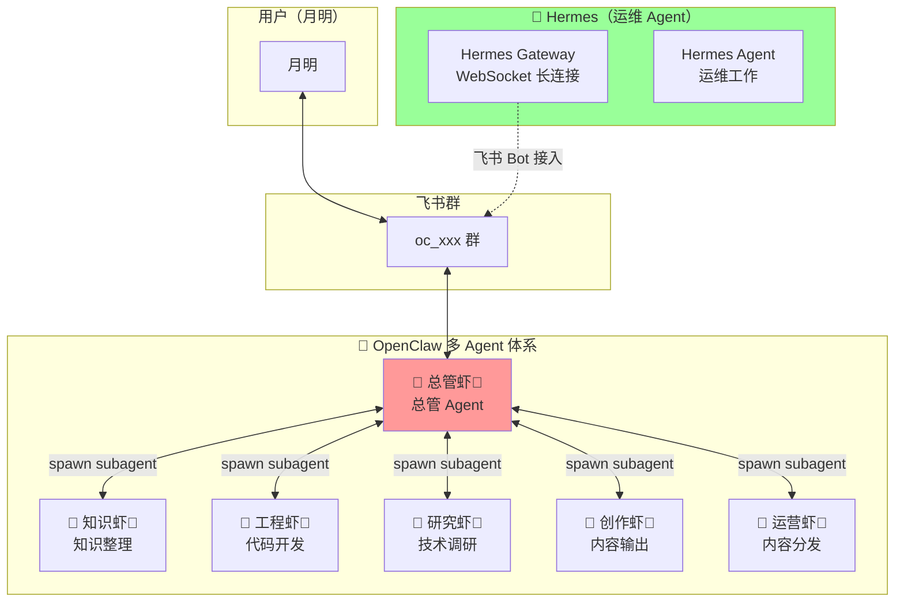
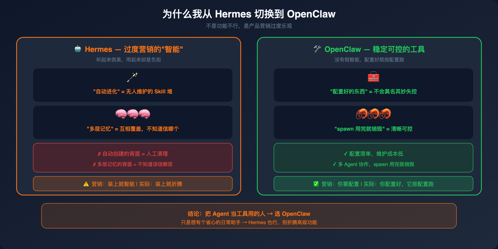
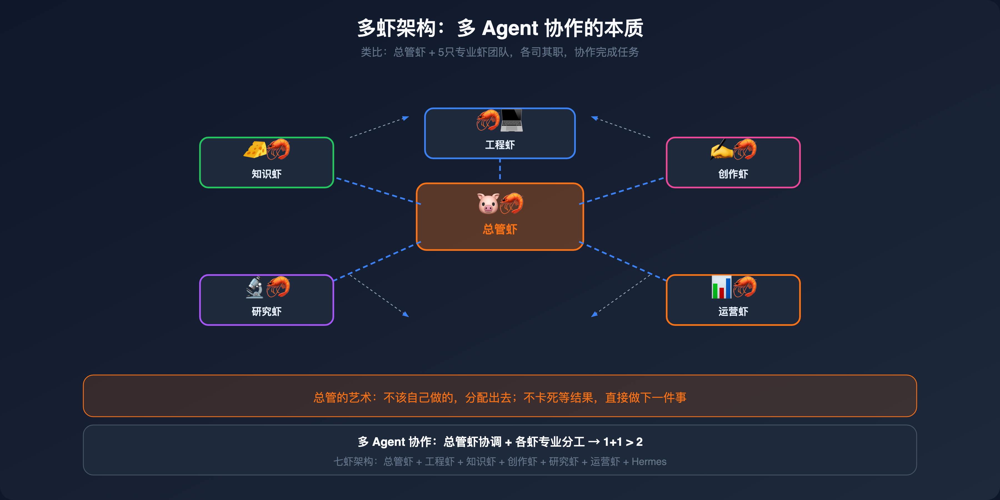

# 第6章：月明的实践——多虾架构落地记

## 架构全貌

我的整体架构是 **OpenClaw 多 Agent 协作 + Hermes 运维接入** 的双轨制：




**关键点：**
- **Hermes 不是虾**，是独立的运维 Agent，负责日常运维工作和飞书 Bot 接入
- **OpenClaw 多 Agent** 是我的核心工作体系，总管虾🦐是总管
- 本地 Mac 不暴露任何端口，各个 Bot主动连出到飞书
- 这套架构不一定

> 💡 【3句话版本】
> - 它就像**一个司令部（OpenClaw 总管虾）+ 一个外包的物业（Hermes）**——司令部发号施令，物业跑腿干活，各干各的，互不干扰。
> - 但问题是**两套系统要同时维护**——Hermes Gateway 用 WebSocket 主动连出，OpenClaw 用自己的飞书 Bot 账号，配置复杂度加倍。
> - 解决办法是**双轨并行但职责分离**：OpenClaw 管工作（多虾协作），Hermes 管运维（飞书 Bot 接入），不要混在一起。

---

## 为什么我从 Hermes 切换到 OpenClaw

这一章不说配置，说点真心话。



### 我曾经神话了 Hermes 的两个功能

**第一个：自动创建 Skill。**

当时觉得"Agent 会自己学习工作流"太酷了。但实际用下来：Skill 越积越多、质量参差不齐、描述互相冲突、没有人知道哪个 Skill 真正在用。自动创建的背面是**无人维护的混乱**。

**第二个：多层记忆系统。**

当时觉得"Agent 有长期记忆 + 短期记忆 + Session 记忆"太强了。但实际用下来：两层记忆之间互相覆盖、新内容看不到、旧的反而反复出现、根本说不清哪个 Provider 在写、哪个在读。多层的背面是**不知道该信哪一层**。

### 问题不是功能，是预期管理

这两个功能本身没有错。但**宣传上把它们包装成了卖点，实际用起来才发现是负担**。

- Skill 自动创建 = 需要人工清理
- 多层记忆 = 需要人工同步
- 自动进化 = 需要人工干预才能不失控

这不是功能不行，是**产品设计和营销过度乐观**，让用户以为"装上就智能"，实际上每个"智能"功能都需要人花时间维护。

### OpenClaw 为什么更适合我

**稳定性强。** OpenClaw 没有 Hermes 那些隐式进化的功能，所以也没有那些隐式失控的可能。配置好的东西就按配置跑，不会莫名其妙多出一堆 Skill 或记忆覆盖。

**多 Agent 协作强。** sessions spawn 是真正的进程隔离，subagent 之间不会互相污染，任务来了就 spawn，完了就销毁，清晰可控。

**没有神话，适合干活。** OpenClaw 不包装"自动进化"，它告诉你的是"你需要配置"。这反而让我用起来更踏实——我知道什么东西在干什么，不会被"智能"的假象忽悠。

### Hermes 适合谁

不是说 Hermes 不好。**它适合：**

- **小白用户**：装上就能用，不需要配置
- **单 Agent 场景**：就一个 Bot 处理日常，不需要多 Bot
- **情感陪伴**：不需要精准执行，就是聊天解闷
- **不想折腾**：能用就行，不追求深度定制

**不要去折腾它的"高级功能"**——自动创建 Skill、多层记忆、Agent 间通信——这些功能听起来美好，用起来需要踩坑，踩完发现不如不用。

> 💡 【3句话版本】
> - Hermes 的**自动进化和记忆系统被过度营销了**——听起来很美，用起来却是负担，需要大量人工干预才能不失控。
> - 但问题不是技术不行，是**产品设计和营销太乐观**——没有说清楚这些功能需要维护成本。
> - OpenClaw 更适合我这种**要把 Agent 真正当工具用的人**——稳定、可控、不包装假智能。

---

## 飞书多 Bot 账号配置

### 账号体系

每个需要直接交互的 Agent 对应一个独立飞书 Bot：

| Agent     | 飞书账号     | 角色        | 响应方式                                 |
| --------- | -------- | --------- | ------------------------------------ |
| 🐷 总管虾🦐  | default  | 总管        | 不用 @，群消息直接响应                         |
| 🦐 知识虾🦐  | zhishi   | 知识整理      | 需要 @ 才响应                             |
| 🦐 工程虾🦐  | coder    | 代码开发      | 需要 @ 才响应                             |
| 🦐 研究虾🦐  | research | 技术调研      | 需要 @ 才响应                             |
| 🦐 创作虾🦐  | write    | 内容输出      | 需要 @ 才响应                             |
| 🦐 运营虾🦐  | ops      | 内容分发/用户运营 | 需要 @ 才响应                             |
| 🤖 Hermes | —        | 运维        | 需要 @ 才响应<br>在群内，通过 Hermes Gateway 接入 |

### 配置结构

```json
// ~/.openclaw/openclaw.json
{
  "channels": {
    "feishu": {
      "accounts": {
        "default": {
          "appId": "YOUR_APP_ID",
          "appSecret": "YOUR_APP_SECRET",
          "groupAllowFrom": ["YOUR_GROUP_ID"],
          "groups": {
            "YOUR_GROUP_ID": { "requireMention": false }
          }
        },
        "zhishi": {
          "appId": "YOUR_ZHISHI_APP_ID",
          "appSecret": "YOUR_ZHISHI_APP_SECRET",
          "groupAllowFrom": ["YOUR_GROUP_ID"],
          "groups": {
            "YOUR_GROUP_ID": { "requireMention": true }
          }
        },
        "coder": {
          "appId": "YOUR_CODER_APP_ID",
          "appSecret": "YOUR_CODER_APP_SECRET",
          "groupAllowFrom": ["YOUR_GROUP_ID"],
          "groups": {
            "YOUR_GROUP_ID": { "requireMention": true }
          }
        },
        "ops": {
          "appId": "YOUR_OPS_APP_ID",
          "appSecret": "YOUR_OPS_APP_SECRET",
          "groupAllowFrom": ["YOUR_GROUP_ID"],
          "groups": {
            "YOUR_GROUP_ID": { "requireMention": true }
          }
        },
        "research": {
          "appId": "YOUR_RESEARCH_APP_ID",
          "appSecret": "YOUR_RESEARCH_APP_SECRET",
          "groupAllowFrom": ["YOUR_GROUP_ID"],
          "groups": {
            "YOUR_GROUP_ID": { "requireMention": true }
          }
        },
        "write": {
          "appId": "YOUR_WRITE_APP_ID",
          "appSecret": "YOUR_WRITE_APP_SECRET",
          "groupAllowFrom": ["YOUR_GROUP_ID"],
          "groups": {
            "YOUR_GROUP_ID": { "requireMention": true }
          }
        }
      },
      "bindings": [
        {
          "type": "route",
          "agentId": "zhishi",
          "match": { "channel": "feishu", "accountId": "zhishi" }
        },
        {
          "type": "route",
          "agentId": "coder",
          "match": { "channel": "feishu", "accountId": "coder" }
        },
        {
          "type": "route",
          "agentId": "ops",
          "match": { "channel": "feishu", "accountId": "ops" }
        },
        {
          "type": "route",
          "agentId": "research",
          "match": { "channel": "feishu", "accountId": "research" }
        },
        {
          "type": "route",
          "agentId": "write",
          "match": { "channel": "feishu", "accountId": "write" }
        }
      ]
    }
  }
}
```

### 关键参数说明

| 参数                      | 说明                        |
| ----------------------- | ------------------------- |
| `requireMention: false` | 总管专属，群消息无需 @ 直接响应         |
| `requireMention: true`  | 下属 Agent，必须 @ 才会响应        |
| `groupAllowFrom`        | 允许 Bot 响应哪些群              |
| `bindings`              | agentId → accountId 的路由映射 |

---

## Hermes Gateway 安装（WebSocket 模式）

### 为什么选 WebSocket？

Webhook 模式需要本地暴露公网 HTTP 端口，复杂且不安全。WebSocket 模式下 Hermes 主动连出，无需任何 inbound 端口，苹果电脑在路由器后面也能正常工作。

### 安装步骤

**1. 创建飞书 CLI App**

```bash
lark-cli config init --new
```

在 [飞书开放平台](https://open.feishu.cn/app) 获取 App ID 和 App Secret。

**2. 配置凭据**

```bash
# ~/.hermes/.env
FEISHU_APP_ID=YOUR_APP_ID
FEISHU_APP_SECRET=YOUR_APP_SECRET
FEISHU_DOMAIN=feishu
FEISHU_CONNECTION_MODE=websocket
GATEWAY_ALLOW_ALL_USERS=true
```

**3. 安装 lark-oapi**

```bash
cd ~/.hermes/hermes-agent
uv pip install lark-oapi --python venv/bin/python
```

验证：
```bash
venv/bin/python -c "import lark_oapi; print('OK')"
```

**4. 注册 launchd 自启**


```xml
<?xml version="1.0" encoding="UTF-8"?>
<!DOCTYPE plist PUBLIC "-//Apple//DTD PLIST 1.0//EN">
<plist version="1.0">
<dict>
    <key>Label</key>
    <string>ai.hermes.gateway</string>
    <key>ProgramArguments</key>
    <array>
        <string>/PATH/TO/.hermes/hermes-agent/venv/bin/python</string>
        <string>-m</string>
        <string>hermes_cli.main</string>
        <string>gateway</string>
        <string>run</string>
        <string>--replace</string>
    </array>
    <key>WorkingDirectory</key>
    <string>/PATH/TO/.hermes/hermes-agent</string>
    <key>EnvironmentVariables</key>
    <dict>
        <key>HERMES_HOME</key>
        <string>/PATH/TO/.hermes</string>
    </dict>
    <key>RunAtLoad</key>
    <true/>
    <key>KeepAlive</key>
    <dict>
        <key>SuccessfulExit</key>
        <false/>
    </dict>
</dict>
</plist>
```

**5. 加载并验证**

```bash
launchctl load ~/Library/LaunchAgents/ai.hermes.gateway.plist
tail -5 ~/.hermes/logs/gateway.log
```

看到 `[Lark] [INFO] connected to wss://msg-frontier.feishu.cn/ws/v2?...` 即成功。

---

## 踩坑总结

| 问题 | 原因 | 解决 |
|------|------|------|
| `lark-oapi not installed` | 装到系统 Python 而非 Hermes venv | 用 `uv pip install --python venv/bin/python` |
| `No module named lark_oapi` | venv 路径写成 `.venv` 而非 `venv` | 确认 venv 目录名是 `venv` |
| 飞书连不上 | launchd 读不到 `.env` 变量 | 把 `HERMES_HOME` 写进 plist |
| Gateway 卡住 | 用了前台模式 | 用 `--replace` 参数 |
| 重启后 Bot 没反应 | launchd 加载失败 | 检查 `gateway.error.log` |

> 💡 【3句话版本】
> - 这些坑都是**环境配置类**的问题——不是代码 bug，是 Hermes Gateway 和 macOS launchd 之间的环境变量传递没配对。
> - 但问题是**错误信息很误导**——`lark-oapi not installed` 其实是路径问题，`No module named lark_oapi` 其实是目录名写错了。
> - 解决办法是**严格按文档走，venv 目录名必须是 `venv`、HERMES_HOME 必须写进 plist、launchd 必须用 `--replace`**。

---

## 小结

**我从 Hermes 切换到 OpenClaw 的核心原因：**

1. **Hermes 的"自动进化"和"多层记忆"被过度神话**——用起来才发现是负担不是优势，维护成本超过收益
2. **产品设计和营销过于乐观**——没有说清楚这些功能需要多少人工干预
3. **OpenClaw 更稳定、更适合干活**——没有假智能，配置好的东西按配置跑，不会莫名其妙失控
4. **多 Agent 协作是 OpenClaw 的强项**——spawn 用完就销毁，清晰可控

**多虾架构核心要点：**

1. **OpenClaw 多 Agent** 是工作主体，总管虾🦐做总管协调
2. **每个 Agent 独立 Bot**：default（总管）、zhishi、coder、research、write、ops，都有自己的飞书 Bot 账号
3. **Hermes 是运维 Agent**，不是虾，负责飞书 Bot 接入和日常运维
4. **多 Bot 账号**隔离：总管不需要 @，下属需要 @
5. **WebSocket 模式**最省心，不需要暴露公网端口
6. **launchd 自启**保证 Gateway 始终在线

> 💡 【3句话版本】
> - 多虾架构的本质是**分工专业化**——总管虾不干活，只协调；下属虾各司其职，spawn 出来用完就销毁。
> - 但问题是**多 Bot 账号的权限隔离要仔细配**——`requireMention: false` 的只有总管，下属 Bot 都要 @ 才响应，否则群里的消息会被多个 Bot 同时抢。
> - 解决办法是**每个下属 Agent 对应一个独立飞书 Bot 账号**，不要共享；bindings 路由要配对正确。



---

## 飞书 Bot 权限配置

> ⚠️ **按需配置**：以下 JSON 模板中的权限列表是**最全配置**，实际使用时建议按需删减不需要的权限。
> 请用户自行编辑填入真实权限值。

```json
{
  "scopes": {
    "tenant": [
      "im:chat:read",
      "im:chat:readonly",
      "im:chat.access_event.bot_p2p_chat:read",
      "im:chat.members:bot_access",
      "im:chat.members:read",
      "im:message:readonly",
      "im:message:send_as_bot",
      "im:message.group_at_msg:readonly",
      "im:message.group_at_msg.include_bot:readonly",
      "im:message.p2p_msg:readonly",
      "im:resource",
      "application:bot.basic_info:read",
      "application:bot.menu:readonly",
      "cardkit:card:read",
      "cardkit:card:write",
      "cardkit:template:read",
      "contact:user.base:readonly",
      "contact:user.email:readonly",
      "contact:user.id:readonly",
      "contact:user.phone:readonly",
      "contact:department.base:readonly",
      "directory:department.base:read",
      "directory:employee.base:read",
      "directory:employee.work:read",
      "docs:doc:readonly",
      "docs:document.content:read",
      "sheets:spreadsheet:readonly",
      "base:app:read",
      "base:app:readonly",
      "base:table:read",
      "base:record:read",
      "bitable:app:readonly"
    ],
    "user": [
      "im:chat:read",
      "im:chat:readonly",
      "im:chat.members:read",
      "im:message:readonly",
      "im:message:send_as_bot",
      "im:message.send_as_user",
      "im:message.group_msg:get_as_user",
      "im:message.p2p_msg:get_as_user",
      "im:resource",
      "contact:user.base:readonly",
      "contact:user.email:readonly",
      "contact:user.phone:readonly",
      "contact:user:search",
      "directory:department:read",
      "directory:department:search",
      "directory:employee:read",
      "directory:employee:search",
      "docs:doc:readonly",
      "docs:document.content:read",
      "sheets:spreadsheet:readonly",
      "base:app:read",
      "base:app:readonly",
      "base:table:read",
      "base:record:read",
      "bitable:app:readonly",
      "offline_access",
      "search:docs:read",
      "search:message"
    ]
  }
}
```

> 📌 **说明**：飞书开放平台对 Bot 权限有严格限制。如需开通所有权限，需要在[飞书开放平台后台](https://open.feishu.cn/app)逐个申请。部分权限需要企业认证才可申请。
